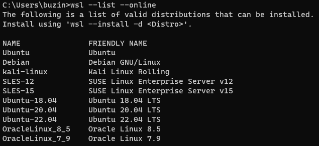
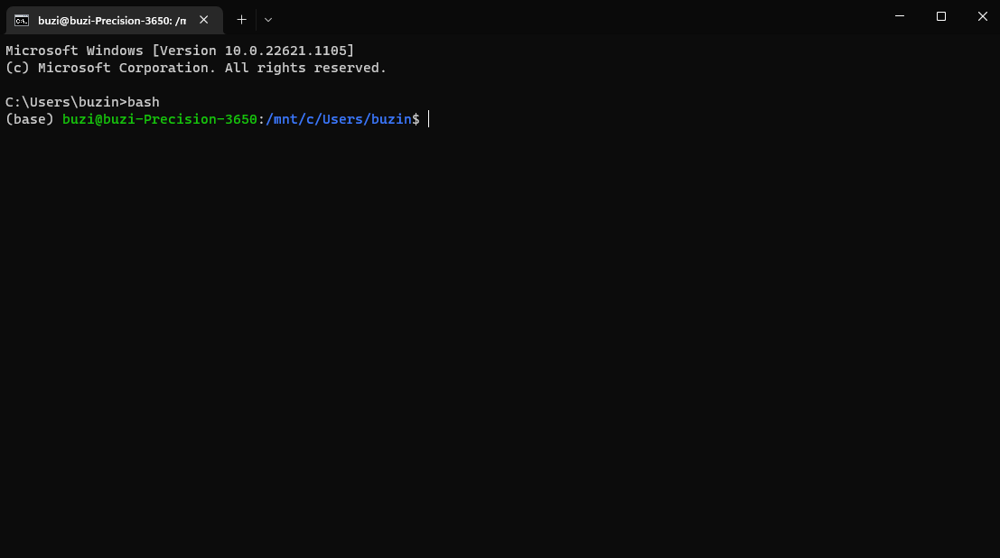
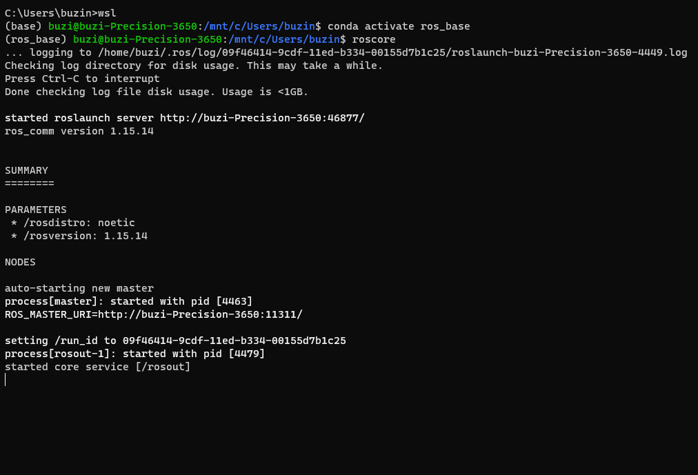
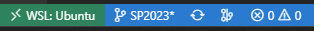

# Install ROBOSTACK ROS-Noetic on Windows

## 1. Bash via Ubuntu in WSL
<!-- ROS is initially designed for Linux system and heavily uses *bash* commands. However, Windows comes with PowerShell. Therefore, the first step is to install a Bash Shell on your window machine. For example, one of the easiest setup is using Git Bash, which you can download from [here](https://git-scm.com/downloads). If you already have a Bash Shell set up, you can skip this step.  -->

ROS is initially designed for Linux system and heavily uses *bash* commands. Previously, the closest thing of this on Windows in PowerShell, but now, you can install Windows Subsystem Linux (WSL), with Ubuntu distribution and then install Robostack similarly to how you will install it on a native Linux device. Refer to [Install Linux on Windows with WSL](https://learn.microsoft.com/en-us/windows/wsl/install) for more information.

### Prerequisites
Your Windows device must be running Windows 10 version 2004 and higher (Build 19041 and higher) or Windows 11 to continue with this instruction. If you are on an earlier version, please refer to the [manual install page](https://learn.microsoft.com/en-us/windows/wsl/install-manual) for more information on how to get WSL running on your device.

### Install WSL command
Open a terminal from your Windows device by pressing `Windows + R`, then type in `cmd` to run the Windows Command Prompt and enter.

In the Windows Command Prompt, enter `wsl --list --online` to see a list of Linux distributions that you can install.



Enter the `wsl --install` command with flag `-d` to choose your distribution. We will be using Ubuntu 20.04 LTS.
```
wsl --install -d Ubuntu-20.04
```
### Set up your Linux user info
Once Ubuntu is installed, you will need to create a user account and a password. Once everything is done, restart your device. The first time you launch a newly installed Linux distribution, a console window will open and you'll be asked to wait for files to de-compress and be stored on your machine. All future launches should take less than a second.

### Check to see if WSL and Ubuntu is installed correctly
You can list your installed Linux distributions and check the version of WSL each is set to by entering the command `wsl -l -v` in PowerShell or Windows Command Prompt.


### Upgrade version from WSL1 to WSL2
If your Ubuntu Version is 2, you can skip this step. We will be using WSL2 as it provides better support for GUI applications and runs generally faster than WSL1. If your Windows version met the prerequisite, and that you are installing your Linux distribution with `wsl --install` command, then WSL2 is used by default. Move to the next step if you are already using version 2 of WSL.

If you see that your installed Linux distribution is running WSL1, run the following command to update from WSL1 to WSL2 for that distribution:
```
wsl --set-version <distro name> 2
```
Example `wsl --set-version Ubuntu-20.04 2` will set your Ubuntu 20.04 distribution to use WSL2.

### Launch your newly installed Ubuntu in WSL
In your Windows Command Prompt, enter either `wsl` or `bash`, your Ubuntu CLI will be launched.



## 2. Install Robostack
Now that you have installed an Ubuntu distribution on your Windows device, we can install everything else using the install script for Linux devices. 

Enter your Ubuntu dist, navigate to `Host_Setup/RoboStack` then run:
```
chmod +x ros_conda_install_unix.sh
./ros_conda_install_unix.sh
```

## 3. Test it out
Open a new terminal, and run activate your ROS environment by ```conda activate ros_base```.

Then run ```roscore``` to start the ROS master. If everything works, you will seee


Check if your X11 forwarding is working well with WSL by running an application with GUI interface. As we have installed RoboStack, let's run rviz
```
rviz
```

## 4. Common issues
Check it out [here](/FAQ/readme.md)!

## 5. Tips and tricks with WSL
You can think of Ubuntu WSL2 is a native Linux distribution running on top of your Windows OS. Meaning that, you can run basically everything that will run on a Linux device, including vscode directly inside WSL. Your vscode windows will show something like this at the bottom left corner indicating that the vscode server is hosted within WSL.


