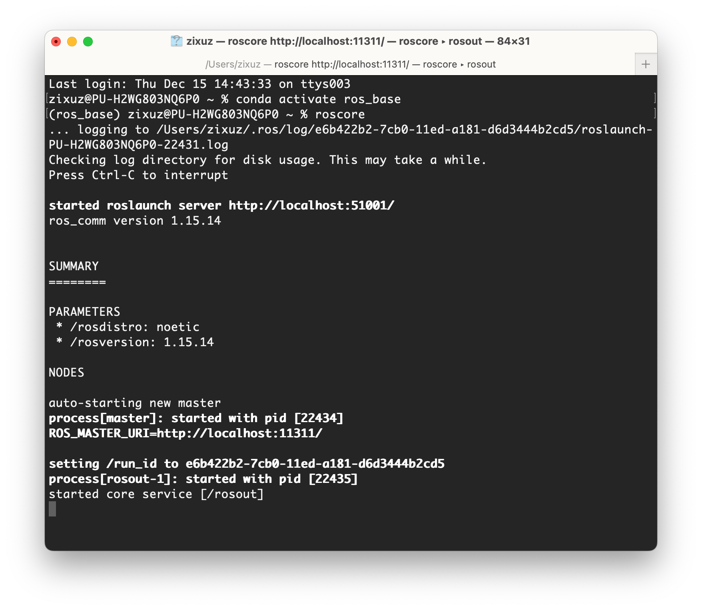

# Install ROBOSTACK ROS-Noetic 
[RoboStack](https://robostack.github.io/index.html) is a bundling of the Robot Operating System (ROS) by Open Robotics for Linux, Mac and Windows using the Conda package manager. Traditionaly, ROS is only available to Linux and does not work well with Conda.

## Mac OS and Linux
If you are using Mac OS or Linux, we provide you a simple script to automate the process. Simply open a terminal, then run

```
chmod +x ros_conda_install_unix.sh
./ros_conda_install_unix.sh
```
If you already have conda (anaconda/miniconda/miniforge, etc) installed, it will install [**mamba**](https://mamba.readthedocs.io/en/latest/installation.html) in your base environments, and then create a new python3.9 environment with ROS Noetic installed.

If you do not have conda installed, the script will first install [**mambaforge**](https://github.com/conda-forge/miniforge#mambaforge), and then create a new ROS Noetic environment. 

## Windows 10+
You have to use Windows Subsystem Linux. Please refer to this [tutorial](Windows/windows_robostack.md) for setup.

# Test it out
Open a new terminal, and run activate your ROS environment by ```conda activate ros_base```.

Then run ```roscore``` to start the ROS master. If everything works, you will seee


# Common Issues
Check it out [here](/FAQ/readme.md)!


# Reference
```
@article{FischerRAM2021,
    title={A RoboStack Tutorial: Using the Robot Operating System Alongside the Conda and Jupyter Data Science Ecosystems},
    author={Tobias Fischer and Wolf Vollprecht and Silvio Traversaro and Sean Yen and Carlos Herrero and Michael Milford},
    journal={IEEE Robotics and Automation Magazine},
    year={2021},
    doi={10.1109/MRA.2021.3128367},
}
```
