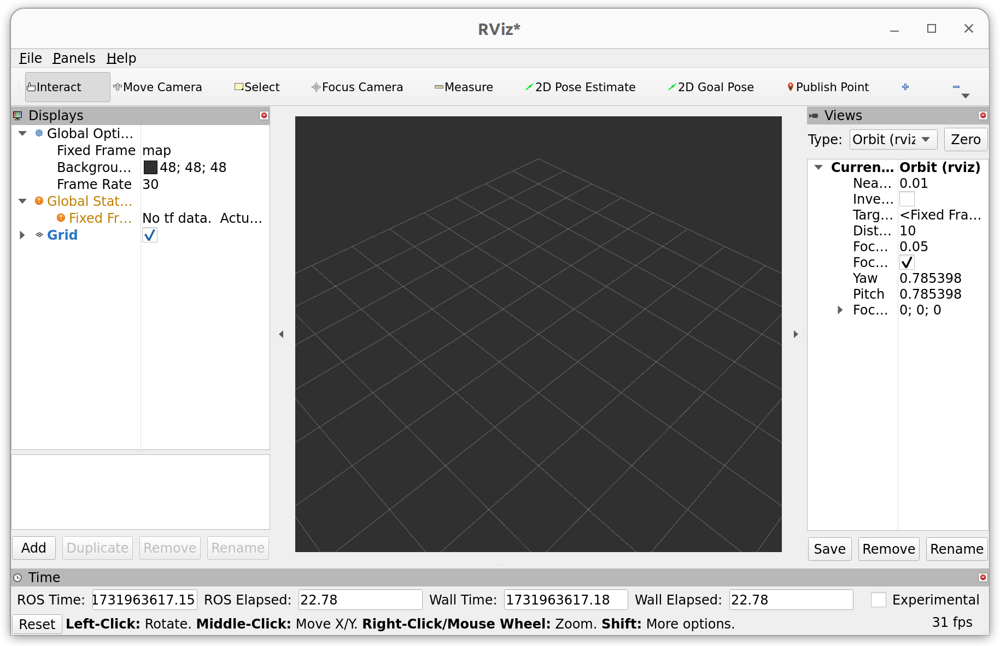

# ECE 346 - Intelligent Robotic Systems
**This repo hosts lab materials for *ECE 346: Intelligent Robotic Systems* at Princeton University.**


<!-- To keep your forked repo updated, please fetch upstream every time we release a new lab assignment. If you are not familiar with fetch, please check out this [tutorial](https://docs.github.com/en/pull-requests/collaborating-with-pull-requests/working-with-forks/syncing-a-fork). -->

# Getting Started
> **Note:** If you are following this repository outside of ECE 346 or are refreshing your ECE 346 laptop, please skip to [Set up ROS2 Environment via RoboStack](https://github.com/SafeRoboticsLab/ECE346/tree/SP2024?tab=readme-ov-file#set-up-ros2-environment-via-robostack) after cloning the repository with `git clone --recurse-submodules https://github.com/SafeRoboticsLab/ECE346.git`. 

## Connect to Wi-Fi
First, you will need to connect your ECE 346 laptop to a Wi-Fi network. To connect to eduroam, open your terminal and run

```
python3 ~/Downloads/eduroam-linux-Princeton_University-Princeton_eduroam.py
```
If you don't see this file, you can temporarily connect to puvisitor using a non-Princeton email to [download it](https://cat.eduroam.org). Click 'Yes' and enter one group member's username, i.e., netid@princeton.edu and corresponding password. Then navigate to your Wi-Fi networks by clicking the top right of your screen, selecting the Wi-Fi logo followed by 'Select Network', 'eduroam', 'Connect'.

## Set up GitHub on your laptop
Next, you will connect your laptop to one group member's GitHub account using an SSH key. In your terminal, run
```
# Install packages to use GitHub and copy/paste
sudo apt install git xclip
```
```
# Replace with your GitHub email address
ssh-keygen -t ed25519 -C "your_email@example.com"
```
Press enter three times to skip requiring a password for each push/pull. Then run,
```
# Start the ssh-agent and add your private key to it
eval "$(ssh-agent -s)"
ssh-add ~/.ssh/id_ed25519
```

Open Google Chrome and log into [GitHub](http://github.com) using the same email from previous steps. In the upper-right corner of any page on GitHub, click your profile photo, then click 'Settings'. In the "Access" section of the sidebar, click  'SSH and GPG keys'. Click 'New SSH key'. In your terminal, run this command to copy your SSH key

```
# Copy public ssh key to your clipboard:
cat ~/.ssh/id_ed25519.pub | xclip -selection clipboard
```

Now in your browser, enter 'ece346-XX' for 'Title', where XX is your group number. For 'Key', simply paste the SSH key that you just copied.

Finally, complete your GitHub configuration in your terminal
```
# Replace with your GitHub email address and full name or a fun alias ;). Note this will appear on GitHub
git config –global user.email “your_email@example.com”
git config –global user.name “Your Name”
```

**Setting up GitHub on VSCode**

In VSCode, log into [GitHub](https://github.com/). Click the settings icon, then 'Back up and sync settings', 'Sign in', 'Sign in with GitHub'.


## Create a private fork
**If you've never used git before, we recommend this introductory [tutorial](https://www.atlassian.com/git/tutorials).**

1. In the upper-right corner of any page on [GitHub](https://github.com/), select '+', then click New repository.

2. Type ECE346_GroupXX as the name for your repository, and an optional description.

3. Choose 'Private' as your repository visibility.

4. Click 'Create repository'.

5. In your terminal, run the following command. **Important**: `--recurse-submodules` is neccessary to get all submodules, i.e., linked specific commits of separate GitHub repositories!
    ```
    git clone --recurse-submodules https://github.com/SafeRoboticsLab/ECE346.git
    ```

6. From inside the cloned directory, rename the original 'ECE346' GitHub repo to 'upstream' (default is 'origin'), which you'll use to fetch future lab assignments and updates.
    ```
    cd ECE346
    git remote rename origin upstream
    git remote set-url --push upstream DISABLE
    ```
    
7. Add your new private repository as a new remote named 'origin'. Note, this is just typical name for the 'primary' remote (online repository). To locate your private repo's URL, navigate to its main page on GitHub, select the green <>Code icon, select SSH and copy this URL to your clipboard. 
    ```
    git remote add origin <URL of your private Repo>
    ```
    
8. Push the 'SP2025' branch of your local cloned repository to your new private remote one, which has now become a private fork of 'ECE346'.
    ```
    git push -u origin SP2025
    ```
    
### Push to your private repository

When working on the labs and making changes to your code, you can push the code to your private repo on GitHub by simply doing:
```
git push origin
```

### Pull updates from the original ECE346 repository
**Not sure about merge? It is never a bad idea to keep a copy locally before merging.**
1. Commit all of your changes
   ```
   git add .
   git commit -m "Updates for Lab X"
   ```
2. Create a temporary local branch on your computer.
    ```
    git checkout -b temp
    ```
3. You can now merge the original 'upstream' repo into your temporary local branch.
    ```
    git pull upstream SP2025
    ```
    This will create a merge commit for you. If you encounter any conflicts, this [tutorial](https://www.atlassian.com/git/tutorials/using-branches/merge-conflicts) can help you take care of them.
4. Inspect all changes that you have made in the temporary branch, then checkout your `SP2025` branch.
    ```
    git checkout SP2025
    git merge temp
    git branch –-delete temp
    # Update submodules in case there are any
    git submodule update --init --recursive
    ```
Once you are fully comfortable with the git merge workflow, you may want to skip steps 1 and 3 and `git pull` directly into your local `SP2025` branch.

## Set up ROS2 Environment via RoboStack
One crucial component of ECE346 is the Robot Operating System (ROS) by Open Robotics. Even though most your robot's computation will be handled on board, it's very useful to set up ROS on your computer for development, testing, and visualization. We use [ROS2 Humble](https://docs.ros.org/en/humble/index.html) on [RoboStack](https://robostack.github.io/) for portability across Linux and MacOS and to easily manage packages with conda/mamba. To set up our environment, `cd` to the ECE346 directory in a terminal, then run

```
sudo apt install curl
cd Host_Setup
chmod +x ros_conda_install_unix.sh
./ros_conda_install_unix.sh
```
This process should take ~5 minutes. If you already have conda (anaconda/miniconda/miniforge, etc) installed, it will install [**miniforge**](https://github.com/conda-forge/miniforge) in parallel with your current conda, and then create a new python3.11 environment with ROS2 Humble installed.

If you do not have conda installed, the script will first install [**miniforge**](https://github.com/conda-forge/miniforge), and then create a new ROS Noetic environment. 

We create an alias for activating the new environment called ```start_ros```. You can activate the environment by running either `start_ros` or `
conda activate ros_base`.

## Test it out
Open a new terminal, and run activate your ROS environment by `start_ros`.

Then run `rviz2` to start RViz, a 3D visualization tool for ROS2. If everything works, you will see


### Common Issues
**"Unable to contact my own server at [http://xxxx]"**
You will typically see this error on Mac OS. This is because the default ROS master is not set to localhost. To fix this, you need to run following lines to in your terminal. 

```
export ROS_HOSTNAME=localhost
export ROS_MASTER_URI=http://localhost:11311
export ROS_IP=localhost
```
We also provide a script to automate this process. Simply run `source local_ros.sh` in your terminal.

**Important**: You need to run these lines ***every time*** you open a new terminal. **Or**, you can export them to your shell profile by running 

```
proile= # choose from ~/.bash_profile, ~/.zshrc, and ~/.bashrc
echo "export ROS_HOSTNAME=localhost" >> $profile
echo "export ROS_MASTER_URI=http://localhost:11311" >> $profile
echo "export ROS_IP=localhost" >> $profile
```

## Want practice with ROS2?
We have a ROS2 cheat sheet for you! Check it out [here](Docs/ROScheatsheet.pdf).

## Frequently Asked Questions
Please check out our [FAQ](FAQ/readme.md) page for common questions.

# Lab Assignments
## [Pre-Lab 0: Introduction to ROS](Docs/Intro_ROS.pdf)
## [Pre-Lab 0: Introduction to Mini-Truck](Docs/Intro_Mini_Truck.pdf)
## [Lab 0: Introduction to ROS](ROS_Core/src/Labs/Lab0)
## [Lab 1: ILQR Trajectory Planning](ROS_Core/src/Labs/Lab1)
## [Lab 2: Collision Avodiance and Navigation in Dynamic Environment](ROS_Core/src/Labs/Lab2)
## [Lab 3: MDP and POMDP](ROS_Core/src/Labs/Lab3)
## [Lab 4: Imitation Learning](ROS_Core/src/Labs/Lab4)

# Reference
```
@article{FischerRAM2021,
    title={A RoboStack Tutorial: Using the Robot Operating System Alongside the Conda and Jupyter Data Science Ecosystems},
    author={Tobias Fischer and Wolf Vollprecht and Silvio Traversaro and Sean Yen and Carlos Herrero and Michael Milford},
    journal={IEEE Robotics and Automation Magazine},
    year={2021},
    doi={10.1109/MRA.2021.3128367},
}
```
