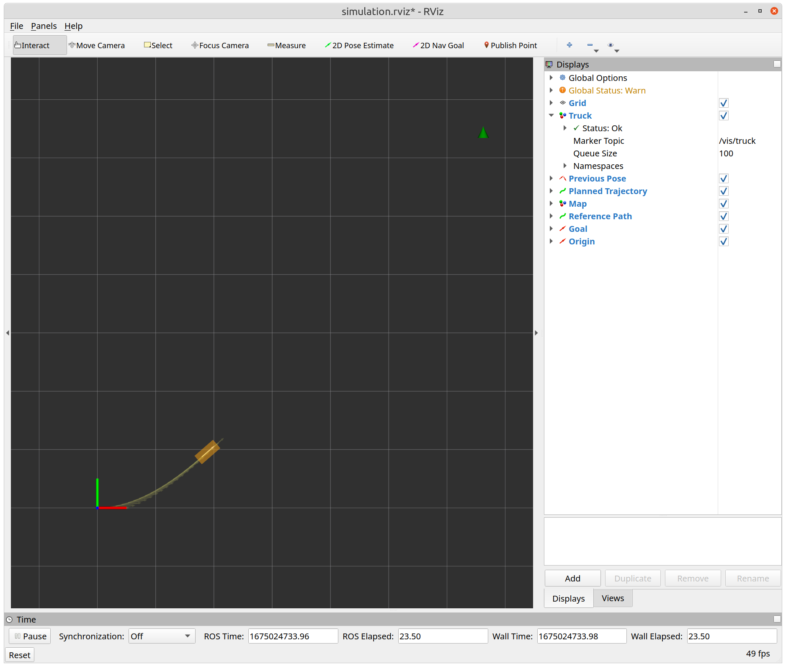

# Lab 0 - Introduction to ROS and Mini Truck

## Overview & Goals
1. Get familar with the hardware of the truck:
    - Turn the truck on and off.
    - Remote control the truck.
    - Replace the battery.
2. Get familar with the software interface of the truck:
    - Connect to the truck via SSH.
    - Run the SLAM and controller nodes.
    - Play around with RViz visualization and the QRT control panel.
4. Learn basic ROS sub/pub:
    - Subscribe to Odometry topic and publish control command.
5. Learn ROS parameter server:
    - Set the parameters from launch file and command line.
    - Set the parameters from yaml file.
6. Write a simple P controller to reach a goal.

## Get Started
1. Build the workspace from [`ROS_Core`](../..).
```
catkin_make
```
2. Source the workspace. If your terminal uses bash as the shell, use
```
source devel/setup.bash
```
Otherwise, if your terminal uses zsh, use
```
source devel/setup.zsh
```
3. Launch the ros packages and rviz visualization.
```
roslaunch lab0 lab0_simulation.launch
```
Click the **2D Nav Goal** button on the top panel of RViz, and click on the map to set the goal. You should see a green triangle on the map, representing the chosen goal. At the same time, in the terminal you should also see:
```
[INFO] [xxxx.xxx]: Received a new goal [nan, nan]
```

4. Write your code in [`scripts/controller/pure_pursuit.py`](scripts/controller/pure_pursuit.py) and finish all TODOs. Repeat step 3 to see if your controller works.


## Common Issues
This lab depends on several external packages, such as [pySpline](https://github.com/mdolab/pyspline) and [networkx](https://networkx.org/). If you encounter **Cannot find module** errors, try to use install those packages with this [script](/Host_Setup/RoboStack/install_dependency.sh). 
```
cd <Path of your repo>/Host_Setup/RoboStack
source install_dependency.sh
```
