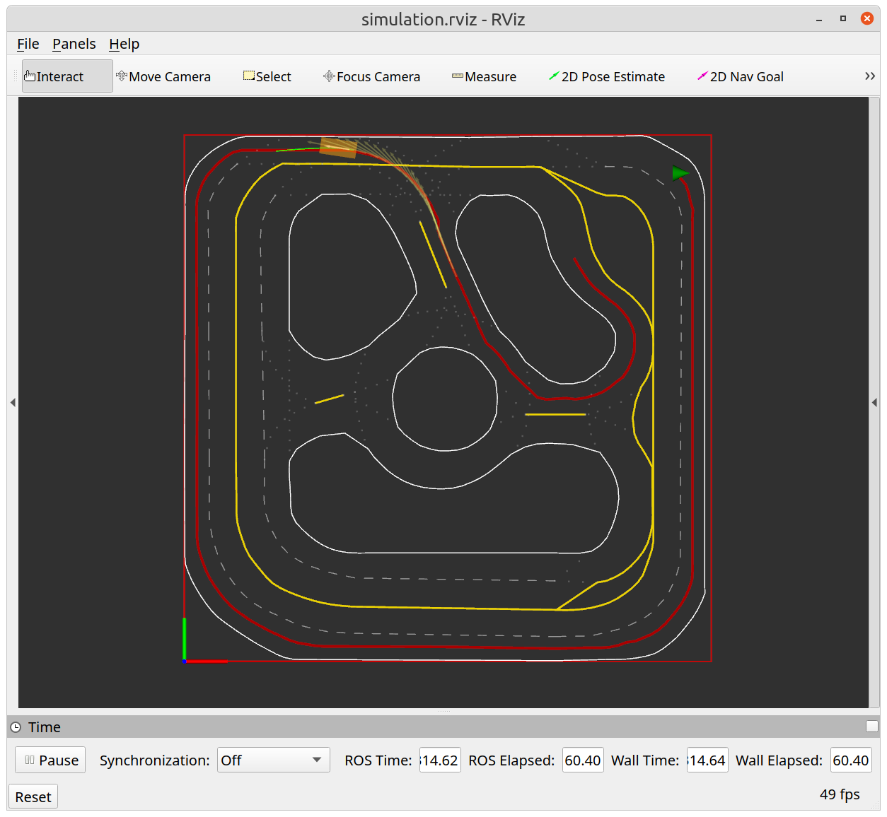

# Lab 1 - Trajectory Planning with ILQR

## Overview & Goals
1. Implement ILQR algorithm to solve the trajectory planning problem.
2. Develop a ROS package to plan the trajectory for the robot in both open-loop and receding-horizon mode.  
3. Demostate the trajectory planning in simulation and on the real robot.

