# Lab 1 - Introduction to ROS
**[Due 11:59PM Thursday, February 13]**

Welcome to the Robotics Assignment ("Lab") component of Intelligent Robotic Systems! Over the semester, we will implement various methods for robot decision-making, both in simulated environments and on physical robotic hardware. In this lab we introduce you to essential concepts in ROS (the Robot Operating System), which will be solidified by analyzing and writing your own ROS code. You will then execute your code both in simulation and on your mini truck, which you'll then demonstrate to a course TA. This lab consists largely of reading and learning the basics of how to run your code for future labs. Although collaboration is always encouraged for labs in this course, we strongly encourage that each group member individually reads through this entire lab, as any future lab work will be difficult without this core understanding. Of course, to get the most out of this course and these labs, you should aim to fully understand and contribute to each assignment. If you plan to list ROS on your resume or CV, it will be assumed that you understand the core concepts that we introduce.

There are **6 tasks** in this lab, and you will need to show your results to a lab TA on slack (i.e., code screenshots and demo videos) or in-person before **11:59PM February 13, 2025**. This lab is quite long, so **start early** and preferably check in with lab TAs after each task.

## Objectives

The following are the objectives of this lab:
- Get familiar with basic ROS concepts.
- Be able to build and run a provided ROS package.
- Get familiar with the visualization and simulation tools for this class.
- Get familiar with the mini-truck platform.
- Learn how to interface with ROS subscribers, publishers, and parameter servers.
- Learn how to run your own software on the Mini Truck.
- Develop and test a goal-reaching controller for your robot.

## Setting Up ROS

Before we get started, you need to set up the Git Repository and configure your computer for the lab. Please read through the detailed instructions [here](https://github.com/SafeRoboticsLab/ECE346).

# Intro to ROS

ROS is an open-sourced framework for controlling robotic components from a computer. You can generally think of ROS as a graph or network of independent **ROS nodes**. Each ROS node communicates via **ROS messages** by **publishing** and **subscribing** to **ROS topics**. Published messages will be received by any node in the graph subscribed to the corresponding **ROS topic**.

Most roboticists today create ROS software using either Python ([rospy](http://wiki.ros.org/rospy)) or C++ ([roscpp](http://wiki.ros.org/roscpp])), as both languages are well-supported in the ROS community. In this class, our default working language is Python. However, you will find that it is simple to adapt ROS in the other language once you master one of them.

## Key Concepts in ROS

**[ROS Master](http://wiki.ros.org/Master)**: The ROS Master serves as the central coordinator of the ROS system. It provides naming and registration services to the rest of the nodes in the ROS system. It other words, it tracks publishers and subscribers to topics and services.

**[ROS Nodes](http://wiki.ros.org/Nodes)**: A node is a process that performs some computation. For example, a robot with a control system typically consists of many nodes. A robot can have many nodes, each meant to operate at a fine-grained level. For example, a node for processing camera images, a node that controls the robot's motors, a node that performs localization, a node that performs path planning, etc.

**[ROS Message](http://wiki.ros.org/Messages)**: Communication between ROS nodes is done through ROS messages. A ROS message is a simple data structure, comprising integers, floating-point numbers, booleans, and arrays of those data types, defined by a `.msg` file. Messages can include arbitrarily nested structures and arrays as defined by the user.

**[ROS Topics](http://wiki.ros.org/Topics)**: ROS nodes communicate with one another by publishing and subscribing to topics that contain messages. The ROS topics provide ID to the correct channel of communication.

**[ROS Services](http://wiki.ros.org/Service)**: A ROS service is a type of message that allows two-way communication. This may be necessary for robotics applications where you need to change the robot's mode and receive acknowledgment of receiving the request. This process can be accomplished by using ROS services which depends on `.srv` files.

**Note**: ROS services do not use topics for their communication. They operate on a separate request-response mechanism and are designed for synchronous communication, unlike topics which are used for asynchronous communication. The node offering the service (the server) defines a service interface. Another node (the client) sends a request to the server. The server processes the request and sends back a response.

**[Catkin Build System](http://wiki.ros.org/catkin/conceptual_overview)**: A build system compiles source code (e.g., nodes, messages, configs, launch files) and creates executable programs. ROS has a custom build system called catkin. Catkin was created to alleviate the complexity of using existing build tools.

**[ROS Catkin Workspace](http://wiki.ros.org/catkin/workspaces)**: A catkin workspace is a directory used to modify, build, and install multiple catkin packages. Anything we do with ROS will be inside of a catkin workspace (e.g., some arbitrary name directory like `ROS_Core`, `catkin_ws`, `py_ws`, `cpp_ws`, etc. with a `src` subdirectory).

**[ROS Catkin Package](https://wiki.ros.org/Packages)**: A catkin package is a directory that contains source code for your ROS nodes, descriptions for your custom ROS messages and services, or other libraries used in ROS.

**[Parameter Server](http://wiki.ros.org/Parameter_Server)**: A parameter server is a shared, multi-variate dictionary, which is accessible to all nodes to store and retrieve data by keys from at runtime.

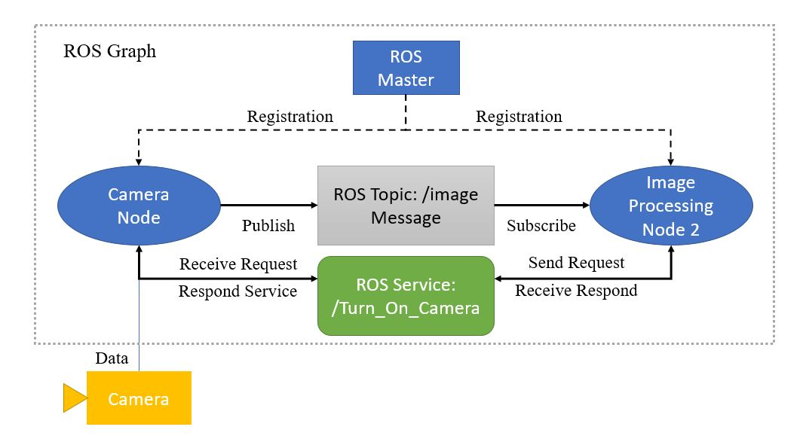
***Figure 1**: A ROS graph example containing two nodes*

Putting those terms together, let us consider the example in **Figure 1**. We have a ROS master with two registered nodes: the camera node and the image processing node. The camera node talks to the camera through an API that is independent of ROS. It publishes an image message to the `image` topic. The image processing node is subscribed to the `/image` topic and receives the image message for further processing. Additionally, let's assume the camera costs a lot of energy to run and should only be used when needed. We can use the ROS service `/Turn_On_Camera` to ask the camera node to turn on the camera. The image processing node can send this service request, and it begins computation once the camera sends back the response.

The main advantage of ROS is that it is a modular system. What if we want to have another process to do localization based on camera images? Using ROS, we can simply set up a new localization node that subscribes to the same `/image` topic, without the need to change code in the other two modules. Similarly, if we deploy the system to another robotic platform with a different camera, we just need to make sure the new camera node publishes the same type of image messages, and keeps using other downstream packages.

## ROS Catkin Workspace

A catkin workspace is a directory (folder) that contains all catkin packages. You can think of this as the main folder that contains everything you need for a specific project or lab. A catkin workspace can store multiple catkin packages and allows us to build all of the catkin packages at the same time. We will learn more about the build process later in this reading, but we must build a workspace to convert source code into executable files. If you don't use a catkin workspace, you can build catkin packages independently, however, this can be very tedious when there are several packages that need to be built.

## ROS Catkin Package

As previously mentioned, a catkin package refers to a directory that contains source code for ROS nodes, services, messages, etc. Catkin packages are located inside the catkin workspace under the `src` sub-directory. A given project workspace will likely contain many packages inside `src`.

While ROS provides a tool to create a catkin package using the command [`catkin_create_pkg`](http://wiki.ros.org/ROS/Tutorials/CreatingPackage), we have provided a template package called `first_pkg` in [our Git repository](https://github.com/SafeRoboticsLab/ECE346/tree/SP2025/catkin_ws/src/first_pkg0) (`catkin_ws/src`) for this tutorial and also for your future labs. To create a `catkin_package`, one can use the command

```bash
catkin_create_pkg <package_name> [dep1] [dep2] [dep3]
```

Let's first inspect what's inside the `first_pkg` catkin package. A typical file tree of a catkin package can be seen in **Figure 2**.


***Figure 2**: File tree for our `first_pkg`*

The `launch` directory has launch files for the purpose of launching one or multiple nodes within the package.

The `scripts` directory holds executable python scripts that contain nodes and their dependency packages.

The `src` directory is for C++ source code. Note that this is different from the `src` directory in which the entire workspace source code lives (e.g., `ECE346/catkin_ws/src`).

The `package.xml` file is the manifest file containing metadata about a package. It includes the package's name, version, description, license information, dependencies, and other meta information like exported packages. The detailed requirements of a `package.xml` are listed in this [documentation](http://docs.ros.org/en/melodic/api/catkin/html/howto/format2/index.html).

The `CMakeLists.txt` file is the input to the CMake build system for building software packages. In ROS, the `CMakeLists.txt` file tells ROS which files need to be built and what packages need to be linked. You are still required to have a `CMakeLists.txt` file, even if the entire ROS package is written in Python. Luckily, ROS has a very detailed template for the `CMakeLists.txt` file, and we will provide the proper files for you during this class. To learn more about this, please check out this [documentation](http://wiki.ros.org/catkin/CMakeLists.txt).

For now, we do not need to worry about `package.xml` and `CMakeLists.txt` as they will be provided for most of the packages in this class. Later in the semester, we may dive into those concepts while building more open-ended software for our final projects.

## Building a Catkin Package

You should have already downloaded the class GitHub repository during your initial [laptop set up](https://github.com/SafeRoboticsLab/ECE346), but if not, run

```bash
git clone --recurse-submodules https://github.com/SafeRoboticsLab/ECE346.git
```

Let's build the code in our catkin workspace using the ROS command `catkin_make`. Using the terminal, navigate to the ECE346 directory (`ECE346`) and then navigate to the catkin workspace (`catkin_ws`). The command `catkin_make` should be executed at the top level of your catkin workspace.

```bash
# Navigate to the top level of your catkin workspace
cd ECE346/catkin_ws
# Build catkin workspace
catkin_make
```

After using `catkin_make`, a lot of messages are printed in your console. If everything went well, you should see something similar to:

```bash
    .
    .
    .
    .
Configuring done
-- Generating done
-- Build files have been written to: XXXXX/catkin_ws/build
####
#### Running command: "make -j12 -l12" in "XXXXX/catkin_ws/build"
####
```


**\*Figure 3**: File tree for a catkin workspace with a catkin package after using `catkin_make`\*

After using catkin make, you should notice that your catkin workspace contains two new sub-directories labeled `build` and `devel` and a `CMakeLists.txt` file in the `src` directory. A catkin workspace can be broken down into three separate parts: source (`src`) directory, build (`build`) directory, and development (`devel`) directory. A typical file tree for a catkin workspace with a catkin package can be seen in **Figure 3**. For the purposes of this course, you typically do not have to worry about the `build` and `devel` directories; but for the sake of understanding your codebase (and supporting curiosity), let’s break down the purpose of these three directories.

**Source (`src`) Directory**: The `src` directory is the home for all catkin packages. It contains all source code, and it is where we will soon create nodes using Python (or C++ for projects outside this course's labs).

**Build (`build`) Directory**: The `build` directory is the location where CMake builds all of the code from the `src` directory. It keeps catkin and CMake's cache information and other intermediate files.

**Development (`devel`) Directory**: The `devel` directory is the location for the built and executable source code.

## ROS Master and Nodes

Simply put, a ROS node is a process that performs computation. Nodes are combined together into a graph and communicate with one another using streaming messages through topics, sending requests through services, and setting values through Parameter Server. ROS nodes can be written in Python (rospy) or C++ (roscpp) using the ROS client libraries.

### Making a Node Executable

In the last section, we discussed how to build catkin packages using `catkin_make`. In order to add the workspace to the ROS environment you need to navigate to the top level of your catkin workspace `catkin_ws`, activate conda, and `source` the `setup.bash` file.

```bash
# Navigate to the top level of your catkin workspace (if not there already)
cd ECE346/catkin_ws
# Build catkin workspace
catkin_make
# Activate ros_base
conda activate ros_base
# Add workspace to ROS environment
source devel/setup.bash
```

**Super-Duper-Uber Important**: You need to run the `catkin_make` command at the top of your workspace every time you define a new message type, build a new service, or add a new package to your catkin workspace (yes, even in Python). It is good practice to run `catkin_make` **every time you make any changes** to elements in the catkin workspace. Similarly, run `source devel/setup.bash` **every time you make any changes** or when you **open a new terminal window** to use your packages in that workspace. As a reminder, the `source` command is used to run a script and makes new/changed environment variables available (e.g., relevant ROS launch file paths) to your current environment session. A very common error is for launch files or nodes to be ‘not found’ if you forget to run these commands.

### Running ROS Nodes with `roslaunch`

In `first_pkg`, the `scripts` directory has a Python script for the ROS node `first_node.py`. To run this node, first run the same set up commands as above, if you haven't already, i.e.,
```bash
# Navigate to the top level of your catkin workspace (if not there already)
cd ECE346/catkin_ws
# Build catkin workspace
catkin_make
# Activate ros_base
conda activate ros_base
# Add workspace to ROS environment
source devel/setup.bash
```
Recall that our `first_pkg` contains a `launch` directory with the file `first_launch.launch`. The key idea of a launch file is to start the ROS Master (the central coordinator of the ROS system), run our node(s), and assign values to parameters using a single command. We will learn how to create our own `.launch` files in future labs.

```bash
# roslaunch <pkg_name> <launch_file>
roslaunch first_pkg first_launch.launch
```

You should see ’Hello World’ printed out continuously in your terminal. To stop the ROS process, press `ctrl-C` in your terminal window. A detailed guide of launch files can be found [here](http://wiki.ros.org/roslaunch).

# Let's Read and Write ROS!
In this lab, you will implement a simple goal-reaching controller and apply your knowledge of ROS to make it run on both the simulation environment and your mini truck. We will use a proportional controller for the throttle, and a pure pursuit controller for steering. You need to finish **6** tasks by filling in missing codes of file [`pure_pursuit.py`](https://github.com/SafeRoboticsLab/ECE346/blob/SP2025/ROS_Core/src/Labs/Lab1/scripts/controller/pure_pursuit.py) (file path: `ECE346/ROS_Core/src/Labs/Lab1/scripts/controller/pure_pursuit.py`

Before we dive into technical details, let's take a look at what is provided for this Lab. First, please make sure you have the latest version of the ECE346 code in your own private fork (following your initial [laptop set up](https://github.com/SafeRoboticsLab/ECE346), i.e., `git pull upstream 2025`). Under our catkin workspace (`ROS_Core`), we can build all packages, set up the environment, and launch our nodes, all from our terminal, as follows:
```bash
 # Activate ROS environment
conda activate ros_base 
# Navigate to the workspace
cd <Path to your repo>/ECE346/ROS_Core 
# Build ROS packages
catkin_make 
# Set up environment
source devel/setup.bash 
# Launch Nodes
roslaunch lab1 lab1_simulation.launch
```


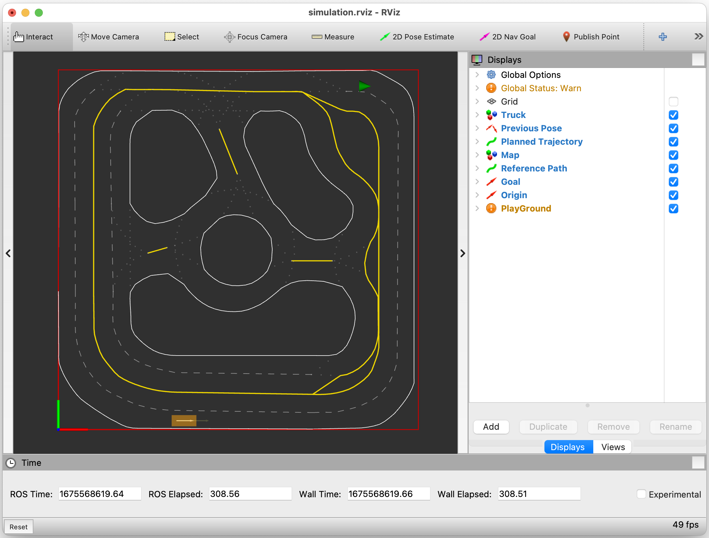
***Figure 3a**: RViz visualization tool*

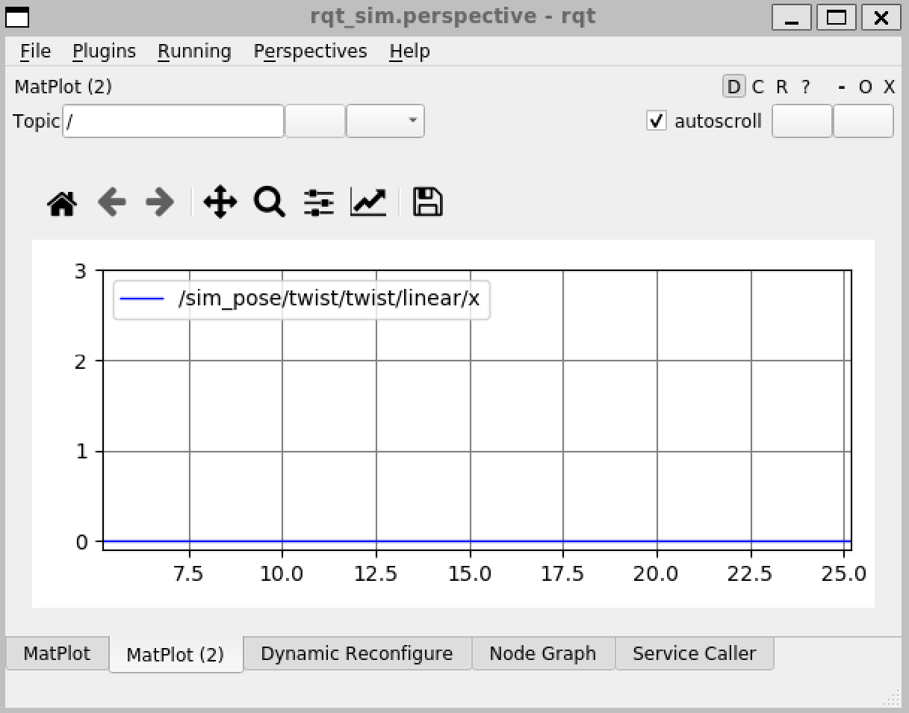
***Figure 3b**: RQT GUI*

Two windows should pop up when you run the above `roslaunch` command. The first window, shown in **Figure 3a**, is managed by an [RViz](http://wiki.ros.org/rviz) node. In the RViz window, you should see an orange rectangle which represents your robot. RViz will serve as the main visualization tool in our class. It is highly configurable, and we will introduce more functionalities (such as visualizing the map and planned routes) in future labs.

The second window, shown in **Figure 3b**, is the [RQT](http://wiki.ros.org/rqt0) GUI (click "Node Graph" in bottom left corner). It is a versatile tool that allows you to inspect your ongoing ROS processes, send ROS messages and call ROS services, visualize data, etc. RQT is highly configurable.
You can [adjust the layout and panels](https://www.clearpathrobotics.com/assets/guides/kinetic/ros/Creating%20RQT%20Dashboard.html) and even [create your own plugins](https://wiki.ros.org/rqt/Tutorials/).


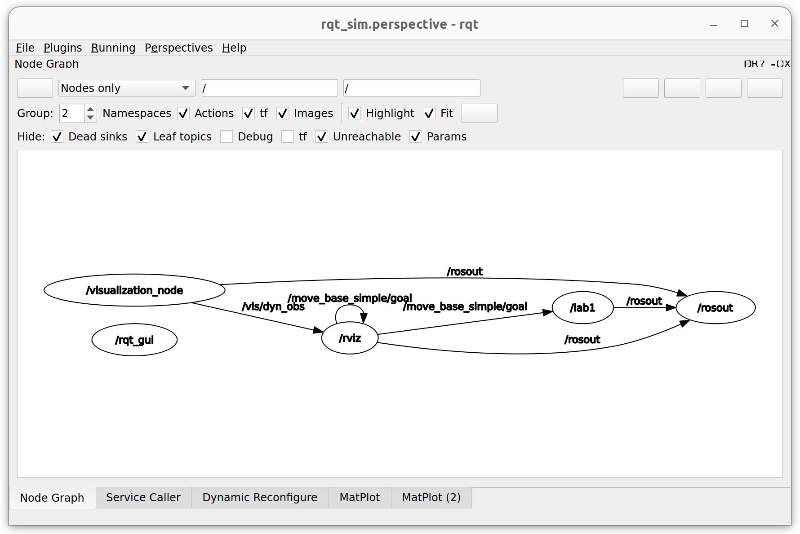
***Figure 4**: Node graph of Lab 1 from RQT GUI. **Note**: Click "Node Graph" in bottom left corner.*

From the RQT GUI, let's first take a look at the node graph page. If the node graph is not shown on your GUI, you can add one from **Plugins** menu on the top of the panel. **Figure 4** shows a node graph of Lab 1 with 6 nodes. The `/rosout` node starts automatically with ROS Master, and it logs messages to your console. The `/rviz`, `/visualization_node` and `/rqt_gui` nodes handle visualization and process monitoring. The `/simulation_node` simulates the dynamics of our robot after executing control commands from the `/lab1` node. All these nodes are started with a single `roslaunch` command. In the next section, we will take a look at the basic functionality of roslaunch.

## `roslaunch` Basics ##
`roslaunch` is a tool for easily launching multiple ROS nodes, as well as setting parameters on the parameter server. `roslaunch` takes in one or more XML configuration files (with the `.launch` extension) that specify the parameters to set and nodes to launch. In Lab 1, you just need to know how to interpret a launch file and pass arguments during `roslaunch`.

### Reading a Launch File ###
Let's first **take a look** at the [launch file](https://github.com/SafeRoboticsLab/ECE346/blob/SP2025/ROS_Core/src/Labs/Lab1/launch/lab1_simulation.launch) you just used. You can click the link or find it locally from `<Path to your repo>ECE346/ROS_Core/src/Labs/Lab1/launch/lab1_simulation.launch`.

The first section, with syntax [`<arg name="AA"  default="BB"  doc="CC"/>`](http://wiki.ros.org/roslaunch/XML/arg), defines a list of arguments that you can pass into this launch file.

The second section, [`<rosparam command="load" file="$(find lab1)/configs/config.yaml"/>`](http://wiki.ros.org/roslaunch/XML/rosparam), loads a list of parameters defined in a YAML file to the ROS parameter server. `$(find lab1)` will ask ROS to find the path to the `lab1` package so that you do not need to type the absolute path.

The third section, with blocks enclosed by [`<include> xxxx </include>`](http://wiki.ros.org/roslaunch/XML/include), specifies other launch files to include during this launch, effectively allowing nesting of launch files. In addition, the syntax `<arg name="XX" value="$(arg AA)"/>` passes argument **AA** in this launch file into argument **XX** of the included launch file.

The last section, with blocks encolosed by [`<node> xxxx </node>`](http://wiki.ros.org/roslaunch/XML/node), starts nodes defined in `lab1_node.py`. Similar to the above section, the syntax [`<param name="YY" value="$(arg AA)"/>`](http://wiki.ros.org/roslaunch/XML/param) loads argument **AA** from the first section into the ROS parameter server with name **YY**.

We will not be writing our own launch file for this lab. That said, you can find a complete guide to launch file syntax [here](http://wiki.ros.org/roslaunch/XML) if you are interested in learning more.

### Passing Arguments in `roslaunch` ###

To pass an argument, we can simply append 
`Argument_Name:=Argument_Value`
 to your `roslaunch` command. For example, let's close our previously launched ROS nodes and try
```bash
roslaunch lab1 lab1_simulation.launch init_x:=1 init_y:=1
```
You will see the car is now starting at a different location.

### Getting ROS Parameters ###
The argument you set in during `roslaunch` are read by your ROS nodes through [ROS Parameter Server API](http://wiki.ros.org/rospy/Overview/Parameter%20Server). In ECE346, we provided a wrapper around this API to search and load a parameter. This can be achieved by using the function
```python
get_ros_param(param_name, default_value)
```
You can find this function [in here](https://github.com/SafeRoboticsLab/ECE346/blob/SP2025/ROS_Core/src/Labs/Lab1/scripts/controller/utils/ros_utility.py), and it will be included for all labs.

## ROS Messages, Topics, Publishers and Subscribers ##
One primary function of ROS is the communication between nodes using messages. The publisher sends out the message to ROS topics, and the subscribers receive the messages. This section will use two examples borrowed from the [ROS official tutorial](http://wiki.ros.org/ROS/Tutorials/WritingPublisherSubscriber(python)) to understand how publishers and subscribers work in ROS. For visualization, the node graph in **Figure 4** indicates which nodes are publishers or subscribers to a certain topic. For example, the `/lab1` node publishes to the `/Control` topic, and the `/simulation_node` is subscribed to the `/Control` topic.

### ROS Publisher ###
First, let us look at the simple ROS publisher code below. In this Python code, we have a node named `talker` that sends messages to a topic named `chatter` at a rate of 10 HZ (every 0.1 seconds).

```python
#!/usr/bin/env python
import rospy
from std_msgs.msg import String

def talker():
    pub = rospy.Publisher("chatter", String, queue_size=10)
    rospy.init_node("talker", anonymous=True)
    rate = rospy.Rate(10) # 10hz
    while not rospy.is_shutdown():
        hello_str = "hello world {}".format(rospy.get_time())
        rospy.loginfo(hello_str)
        pub.publish(hello_str)
        rate.sleep()

if __name__ == "__main__":
    try:
        talker()
    except rospy.ROSInterruptException:
        pass
```

Now, let's break down the code.

```python
#!/usr/bin/env python
```

Every Python ROS Node will have this declaration at the top of the Python file. This line ensures your script is executed as a Python script.

```python
import rospy
from std_msgs.msg import String
```

You need to import `rospy` if you are writing a ROS node in Python. We also need to import our desired data type for ROS messages.  Here, we will import `String` from the standard `std_msgs.msg` data type package.

```python
def talker():
```

Over the next few lines of code, we will define a `talker` node and its publishing capabilities.

```python
pub = rospy.Publisher("chatter", String, queue_size=10)
```

Here, we define a publisher node to publish messages to a desired topic. It declares that we want to publish to the `chatter` topic, using a `String` message, with a `queue_size` argument of 10. The `queue_size` limits the amount of queued messages for the case where a subscriber is not receiving the messages fast enough. Here we are queuing 10 messages.

```python
rospy.init_node("talker", anonymous=True)
```

Now, we will initialize a ROS node in Python. The function `init_node` tells the ROS master the name of your node. The node will be Labeled as `talker`.  We will also set `anonymous = true`. This allows the compiler to append numbers to the end of the node's name to ensure a unique node name (this is useful for more complex simulations).

```python
rate = rospy.Rate(10) # 10hz
```

The ROS rate function, [`rate()`](\href{http://wiki.ros.org/rospy/Overview/Time), defines the speed at which we want to perform some task. Here we define a `rate` handle to maintain a desired speed of 10 Hz (0.1 seconds). Later, we will see that `rate` is used to define the amount of time that the system should sleep in the `while` loop.

```python
while not rospy.is_shutdown():
    hello_str = "hello world {}".format(rospy.get_time())
    rospy.loginfo(hello_str)
    pub.publish(hello_str)
    rate.sleep()
```

This `while` loop structure is fairly standard in `rospy`. The `while` loop will begin to iterate after checking the `is_shutdown` flag. Generally, when we launch nodes, the `is_shutdown` flag is not activated, but when we terminate a node using `Ctrl-C` the `is_shutdown` flag is activated and the loop terminates.

Inside the loop, we first define a string message called `hello_str` that will contain the text "hello world". In this format, the string argument `{}` (or alternatively `%s`) concatenate strings and `rospy.get_time()` prints the current time. Next, using the `loginfo()` function, the string message `(hello_str)` will be printed in the terminal, written to the node's log file, and written to `rosout` (used for debugging).
Using [`pub.publish()`](http://wiki.ros.org/rospy/Overview/Publishers_and_Subscribers), the string message is published to the `chatter` topic. Lastly, `rate.sleep()` is used to maintain a desired loop rate (we previously defined the loop rate as 10 Hz).

```python
if __name__ == "__main__":
    try:
        talker()
    except rospy.ROSInterruptException:
        pass
```

This snippet of code is where we make everything happen. It is the main block of the code which calls upon our previously set up definitions. The main block includes the `talker()` definition and also includes a `ROSInterruptException` to prevent the code from continuing to execute during `sleep()`.

### Task 1: Set up a publisher for the ServoMsg message ###

Now you know how to publish a ROS message. Let's write our first ROS code! Open your `pure_pursuit.py` file in the text editor of your choice (file path: `<Path of your
repo>/ECE346/ROS_Core/src/Labs/Lab1/scripts/controller/pure_pursuit.py`). Your first task is to set up a missing publisher in the function `setup_publisher` following instructions under **TODO**. Make sure you read through the code to get an understanding of variable names (e.g topic name). **Once you are finished, show your code to a lab TA**, either by sending a photo (e.g., a screenshot or clear a photo of your screen with a phone camera) on slack or showing in-person during lab OH, and proceed. Note: you can proceed before receiving confirmation from a lab TA, but to receive full credit for this lab you must show your completed, correct work for each required section before the lab's deadline. This applies for all of Lab 1.

### ROS Subscriber ###
The code for the subscriber is very similar to the publisher and can be seen below. Now, instead of publishing to the `chatter` topic, we are subscribing to it.

```python
#!/usr/bin/env python
import rospy
from std_msgs.msg import String

def callback(data):
    rospy.loginfo("I heard %s", data.data)

def listener(): 
    # Define listener node
    rospy.init_node("listener", anonymous=True) 
    # Subscribe the listener node to chatter topic
    rospy.Subscriber("chatter", String, callback) 
    # spin() simply keeps python from exiting until this node is stopped
    rospy.spin()

if __name__ == "__main__":
    listener()
```

Let us now break down the subscriber code.
```python
#!/usr/bin/env python
import rospy
from std_msgs.msg import String
```

Exactly like the publisher code, we need to setup our Python script and import necessary packages.

```python
def callback(data):
    rospy.loginfo("I heard %s", data.data)
```

Now, we will define a `callback(data)` function.  This function is used to process the received message data. Here, `loginfo()` is used to print to the terminal. The printed messages will begin with the text `"I heard"`  and will then print out the message data received from the chatter topic (`data.data`). This function should make more sense when we discuss the subscriber.

```python
def listener():
    rospy.init_node("listener", anonymous=True)
    rospy.Subscriber("chatter", String, callback)
    rospy.spin()
```
Here, we define the `listener` node, also known as the node that is subscribed to the `chatter` topic. First, the node is initialized so that the master knows the name our new node.

Next, the `listener` is defined as a subscriber.  There are three important categories we need to specify when using the `Subscriber()` function. First, we need to declare the topic that we want to subscribe to. Here we are subscribing to the `chatter` topic.  Second, we need to identify the data type of the ROS message.  The data type for the message of the publisher and subscriber needs to be the same. Therefore the data type of the message will be a `String`. Third, we need to identify the name of the function where the message data will be sent. In our case, we are sending the message data to the `callback()` function.

The `spin()` function keeps the node active until it is manually shut down (`Ctrl-C`).

```python
if __name__ == "__main__":
listener()
```

This last snippet of code is where we actually run the listener code.

### Task 2: Set up a subscriber for the Odometry message ###
Open your `pure_pursuit.py` file.  Your second task is to set up a missing subscriber in the function `setup_subscriber` following instructions under **TODO**. **Once you are finished, show your code to a lab TA** (as a reminder, either by sending a photo on slack or in-person during lab OH).

### Inspecting ROS Messages using [`rostopic`](http://wiki.ros.org/rostopic) and [`rosmsg`](http://wiki.ros.org/rosmsg) ###
Now you are an expert in setting up ROS publisher and subscriber. However, you may be wondering how to decode those ROS messages or figure out what's inside of each datatype in order to write a callback function. The command line tool [`rostopic`](http://wiki.ros.org/rostopic) and [`rosmsg`](http://wiki.ros.org/rosmsg) are designed for this usage.

Let's try this out! First, make sure your RViz is still running. Now, open a new terminal, activate our ROS environment (`conda activate ros_base`), setup the ROS environment (`source devel/setup.bash`), and try:

`rostopic list`

This will print the names of active topics

`rostopic info <Topic Name>`

This will information about a desired topic, including its datatype, publisher, and active subscribers.

`rostopic echo <Topic Name>`

This will print out ROS messages from a desired topic in your terminal

`rostopic type <Topic Name> | rosmsg show`

This will first look up the datatype of the topic, then print out its data structure.  


A full list of [`rostopic`](http://wiki.ros.org/rostopic) and [`rosmsg`](http://wiki.ros.org/rosmsg) functionalities can be found in their documentations.

### Task 3: Fill in the subscriber callback function ###
Open your `pure_pursuit.py` file. Your third task is to fill in the missing code of the function `goal_callback` following instructions under **TODO**.

Once you are finished, **restart** `lab1_simulation.launch` (i.e., `roslaunch lab1 lab1_simulation.launch`). From the RViz simulator, you can add a desired goal location by selecting **2D Nav Goal** from the top panel and then clicking a point on the map. You will see that the position of your clicked point is printed on your terminal.

### Task 4: Construct and publish a ROS message ###

Open your `pure_pursuit.py` file. Your fourth task is to fill in the missing code of the function `publish_control` following instructions under **TODO**. **Once you are finished, show your code to a lab TA.**

## Goal Reaching Controller ##

As a reminder, in this lab, you are implementing a simple goal-reaching controller. We will use a proportional controller for the throttle, and a pure pursuit controller for steering.

### Throttle Control ###
Our robot can control its acceleration through the motor's throttle input. In this Lab, we will implement a proportional controller to track reference speed $V_{ref}$.

$a = K_p(V_{ref}-V\_{robot})$

### Steering Control ###
The pure pursuit method is a geometry-based algorithm to determine desired steering angle for a car to follow a path. As shown in Figure 5, pure pursuit calculates the steering angle $\delta$ to ensure the vehicle reaches the target point (**TP**) according to the kinematic bicycle model. This [tutorial](https://thomasfermi.github.io/Algorithms-for-Automated-Driving/Control/PurePursuit.html) provides an excellent interactive explanation of the pure pursuit algorithm.


***Figure 5**: Geometric Interpretation of Pure-Pursuit Algorithm. [[source](https://thomasfermi.github.io/Algorithms-for-Automated-Driving/Control/PurePursuit.html)]*

In short, you can obtain the steering angle $\delta$ by the equation below, where $L$ is the wheelbase of the robot, $\alpha$ is the relative angle of the look-ahead point w.r.t the robot, and $l_d$ is the distance between the robot and the look-ahead point.

$\delta = \arctan \left(\frac{2 L \sin(\alpha)}{l_d}\right)$

In this lab, we assume the reference path is the straight line connecting your robot and goal point. Therefore, the **TP** is a point on this line segment defined by user parameters.

### Task 5: Implement the goal reaching controller ###
Open your `pure_pursuit.py` file. You will finish the function `planning_thread` following the implementation details under the **TODO** block. This task concludes all coding parts of Lab 1. Relaunch the simulation, set **2D Nav Goal** as any points on RViz, and drive your robot towards the goal point. The default parameter should work well in the simulation if your implementation is correct. **Once you are finished, show your simulation results to a lab TA.**

# Let's Get Real - Intro to *Mini Truck*  #
Autonomous driving has sparked much public interest in the last few years. In this lab, we will work with a 1/14-scale autonomous *mini truck* as our mobile robot platform (**Figure 6**). 

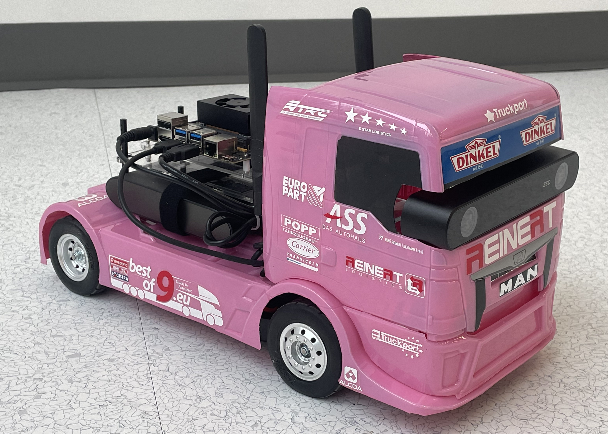
***Figure 6**: The 1/14-scale autonomous **mini truck** used in ECE346 - Intelligent Robotic Systems.*

The modularity of ROS allows us to quickly deploy our algorithms from the simulated environment into the real robot with minimal changes to your code.

### Task 6: Try Out On Mini Truck on the  Track! ###

Read the information about your mini truck robot below (beware lots of reading). Afterwards, follow the instructions and test your goal-reaching controller on the mini truck **in F111** with the provided `lab1_truck.launch`. **Demo your robot (in-person or via video recording on the F111 track) to a lab TA.**

# Intro to Mini Truck!
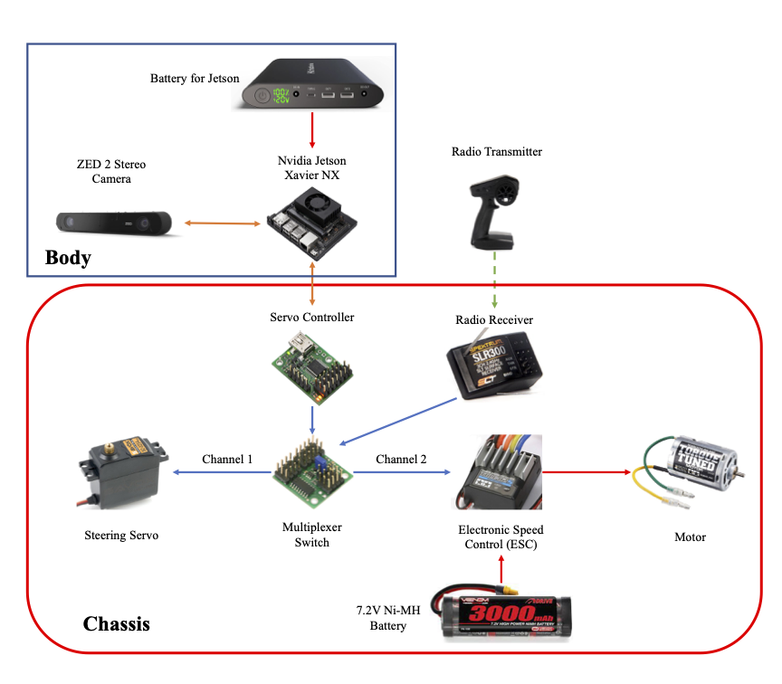
***Figure 7**: A hardware schematic of the robotic platform.*

**Figure 7** overviews the mini truck's key physical components.
The robot's **body** carries an [NVIDIA Jetson Xavier NX](https://www.nvidia.com/en-us/autonomous-machines/embedded-systems/jetson-xavier-nx/) onboard computer, a [ZED 2 stereo camera](https://www.stereolabs.com/zed-2/), and a battery that powers them. These components form the core of the robot's perception and decision-making hardware.

The robot's **chassis** consists of drivetrain components that steer and drive the truck. We use a [TAMIYA TT-01 Type-E](https://www.tamiyausa.com/shop/110-4wd-shaft-drive-road-tt/rc-team-hahn-racing-man-tgs-2/) RC chassis (**Figure 8**), which is a shaft-driven 4WD platform powered by a single 25 turn 540 brushed DC motor. The Jetson is connected with a [Maestro Servo Controller](https://www.pololu.com/product/1350), which translates the command from the Jetson and sends a Pulse Width Modulation (PWM) signal to the steering servo and motor ESC. In order to allow the robot to be driven through a remote controller, we added an additional [servo multiplexer](https://www.pololu.com/product/2806) to switch signals.


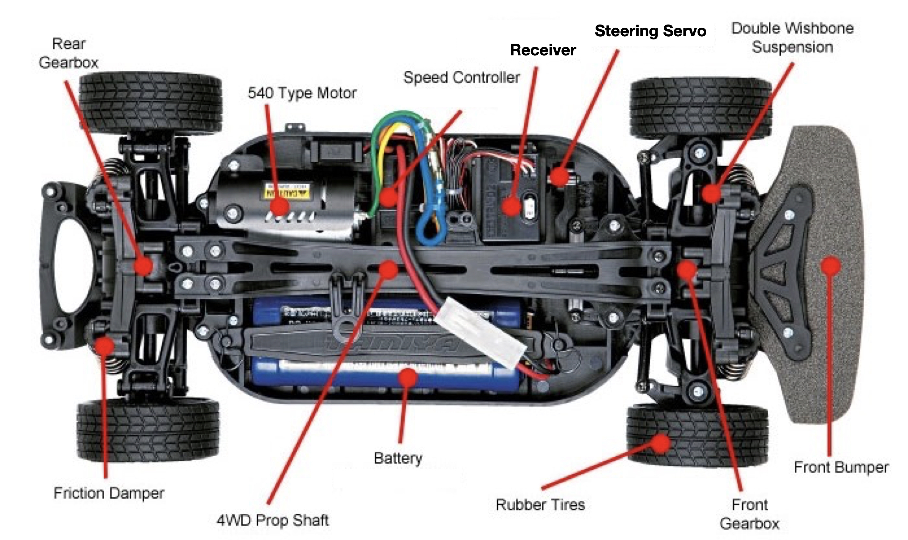
***Figure 8**: TT-01 Type-E Chassis that is used as the base of our robot platform.*

## Safety First ##
Read the following instructions **carefully** before operating the robot, and keep them handy.
### Robot Rules & Responsibilities ###
Please keep the robot and its accessories stored when you are not working with them. You can keep the robot in F111 or take it with you if it is convenient. Either way, please note that **you are responsible for your assigned robot for the duration of the semester**.

* **Use caution and common sense when operating your robot.** Avoid driving it around potential hazards -- including stairs -- or unsuspecting civilians! Beyond basic "bench tests", we strongly recommend you only drive the robot inside the F111 lab space.

* **Let us know immediately if any component is damaged or goes missing,** so that we can address the issue as quickly as possible.If you are experiencing hardware issues with the robot, please consult with a course AI **before** you try to fix it by yourself.

* **Practice with the remote control and drive slowly!** The robot can achieve a maximum speed of over 15 mph (25 km/h). **Injuries and bone fractures are likely** if a person is hit at that level of speed.

* Be **extremely careful** when handling and connecting batteries. **Shorted batteries will cause a fire.**

* Motors can become very **hot** while driving the robot **and** shortly after!

* The motor ESC will automatically cut off power if the Ni-MH battery voltage is too low. However, if the robot has been running for over 30 minutes or you notice a significant power drop, you should **immediately** place the battery in the **uncharged battery bin** and replace it with a charged battery.

* Please be aware that our ability to repair the robots is limited, so take care of your robot accordingly. **If your robot suffers severe damage, you may not be able to complete the lab and final project components of the class.**

## Connecting to Mini Truck ##
### Turning On the Jetson ###
The NVIDIA Jetson Xavier NX takes 12 V - 20 V DC power provided by the power bank mounted right below the Jetson. The power bank can output various DC voltages ranging from **5 V** to **20 V**. In order to avoid damage to the Jetson, **make sure you unplug the power cord before turning on the battery**. First, hold the power button on the battery until it lights up. Then, cycle through the voltage by double-clicking the power button until it shows **20 V**. Underpower will lead to hardware malfunctions. Finally, plug in the power cord, and the Jetson will turn on automatically.

You will see the remaining battery life on the screen. Please note that the power will last less than two hours. To program the Jetson, use the external power supply, labeled **NX PWR**, instead of using the battery.

### Working on the Jetson Directly ###
The Jetson NX runs Ubuntu 20.04 desktop OS and can be used as a regular PC by connecting with a keyboard, a mouse, and a monitor through the HDMI port. The password for login is **nvidia**.

### Working on the Jetson Through SSH Connection ###
When the robot cannot be connected to a monitor and keyboard, for example when it is running on the ground, SSH becomes a useful tool to log into your robot and run programs through the command-line interface. SSH stands for **S**ecure **Sh**ell, a protocol that allows you to securely and remotely connect to your robot using a wired/wireless network connection.

All robots are connected to the local Wi-Fi network **ECE346** at startup. Each will have a reserved IP address **192.168.1.2XX**, where XX is the ID of the robot. For example, if the Jetson on your robot has the label NX-7, the IP address is **192.168.1.207**. Similarly, if your robot is NX-11, the IP address is **192.168.1.211**. Before running SSH, first, connect your computer to the **ECE346** Wi-Fi with password **ece346sp2025**. 

### Task 6.1: Connect to Jetson via SSH ### 
Once you have connected to the network, open a terminal/power shell and type
```bash
ssh nvidia@192.168.1.2XX
```
It will ask you for the login password for the Jetson: enter **nvidia** and you are all set.

### Coding Remotely and Collaborating with VS Code ###
If you want to code directly on your laptop but have the code saved in Jetson directly, one solution is to SSH into the Jetson and use vim or nano through the terminal. On the other hand, if you enjoy using modern IDEs, [VS Code allows you to code remotely through SSH](https://code.visualstudio.com/docs/remote/ssh-tutorial). We also *highly recommend* for students to use the [VS Code Liveshare extension](https://marketplace.visualstudio.com/items?itemName=MS-vsliveshare.vsliveshare) in order to collaborate from multiple personal laptops (e.g. MacOS, Windows, Linux) to write and edit code that is then only executed by your lab group's laptop.

### Mini Truck + Laptop Network Communication via ROS ###
Before we run any decision-making algorithms, we need to ensure our mini-truck knows where it is and can execute our control command. These functionalities have been built on your robot as ROS nodes. We also want to easily visualize the state and future plan of our robot on your own computers. Luckily, ROS has made this easy for us since it is naturally a distributed computing environment that can comprise hundreds of nodes across multiple machines with [network setups](http://wiki.ros.org/ROS/NetworkSetup). 

In general, to pass ROS messages between the robot and your laptop, each must be connected to the same network. We provide two useful scripts for network setups, which we use in the steps below and future labs, but **no need to run these commands now**.
```bash
 # Mini truck robot hosts ROS Master 
source network_ros_host.sh <ROBOT_IP>
# Laptop is "client" of ROS Master (mini truck) 
source network_ros_client.sh <ROBOT_IP> <LAPTOP_IP>
```

In ECE346, `<ROBOT_IP>` is the IP address of your robot (i.e., **192.168.1.2XX**), and `<LAPTOP_IP>` is the IP address of your laptop under ECE346 Wi-Fi, which you can find by running `hostname -I` in a terminal window.

### Task 6.2: Launch Perception (SLAM) and Control Nodes On Robot ###
After sshing into mini truck (**Task 6.1**) and waiting about 60 seconds, launch perception and control nodes from the truck by running
```bash
cd ~/StartUp
# <ROBOT_IP> is 192.168.1.2XX
./start_ros.sh <ROBOT_IP> 
```
The `./start_ros.sh <ROBOT_IP>` command will automatically set your robot as the host of ROS Master using the previously mentioned script and start ROS. The should take ~60 seconds. To be clear, the `start_ros.sh` script runs **locally on the mini truck** to start ROS Master, SLAM, and a control node that sends a signal to the robot's motors and servo. **Please make sure your robot is static on the track in the F111 lab**, because the localization algorithm requires accurate gravitational direction for initialization.

If you encounter the error stating this file is not executable, you can change the permission by the following command and then retry.
```bash
chmod +x start_ros.sh
```

### Task 6.3: Launch Visualization On Your Laptop ###
Next, we open a new terminal on your laptop and navigate to the `ROS_Core` under your Git repository. If you closed your terminal windows from **Task 1-5**, in a new terminal window, activate the conda ROS environment, (optionally) rebuild the workspace, source the set up environment script, source the network configuration script, and launch visualization nodes by running:
```bash
 # Navigate to ROS_Core
cd <Path of your repo>/ECE346/ROS_Core 
# Start virtual environment
conda activate ros_base 
# Optional: Build ROS packages (if new packages)
catkin_make 
# Set up laptop environment
source devel/setup.bash
# Set up laptop ("client") network config
source network_ros_client.sh <ROBOT_IP> <LAPTOP_IP>
# Launch visualization nodes
roslaunch racecar_interface visualization.launch
```

Shortly after, RViz (**Figure 9**) and RQT (**Figure 10**) windows will open.

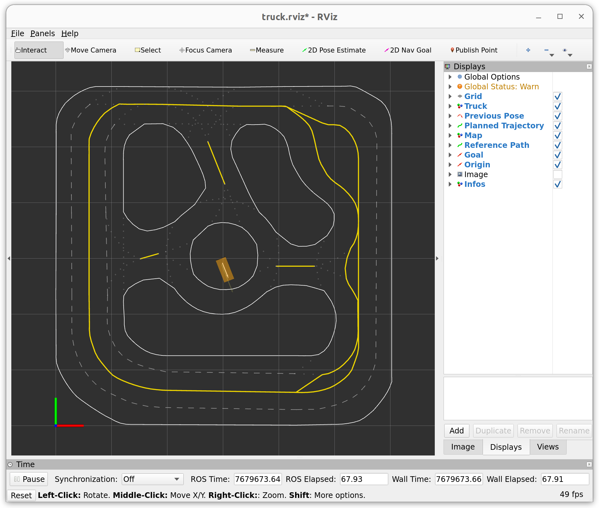
***Figure 9**: RViz visualization tool. An orange box that would appear here indicates the current pose of the robot and the yellow arrows indicate the past poses.*

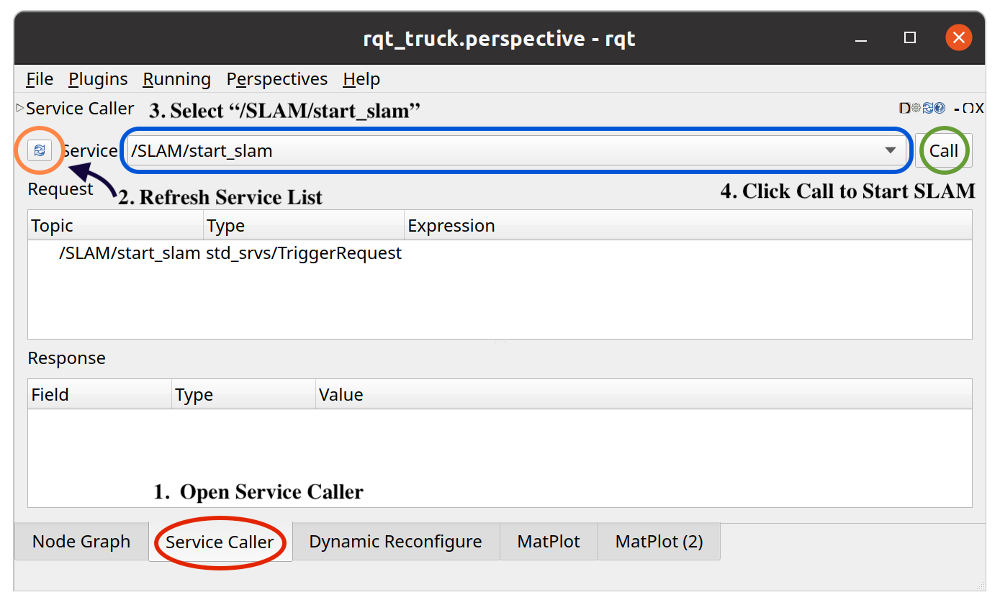
***Figure 10**: RQT GUI*

### Task 6.4: Start Localization ###
On your RQT console (**Figure 10**), first, go to the **Service Caller** page. Then, click the **refresh button** near the top left (this may appear blank) and choose **/SLAM/start_slam** from the drop-down menu. Finally, click the **call** button to start localization.

An orange box will appear on your RViz after your service is called, which indicates the pose of your robot. Follow the instructions below to drive your mini truck around the track following and try to verify if the state estimation is accurate.

**Important**: Localization results will be significantly compromised if fiducial markers are occluded. Please do not stay or place your items inside the room.

## Driving the Robot with the Remote Controller ##
The [remote controller](https://manuals.plus/spektrum/2-4ghz-digital-radio-system-transmitter-manual) (**Figure 11**) allows you to drive the robot manually -- as you would a regular RC car -- and also serves as a **dead man's switch** for the robot. We list each element's function below.

A. **Throttle Trim**: Adjusts the throttle neutral point

B. **Steering Trim**: Adjusts the steering centerpoint. Normally, the steering trim is adjusted until the vehicle tracks straight.

C. **LED**: Indicates the power is ON

D. **Steering Wheel**: Controls the steering angle of the front wheels.

E. **Throttle/Brake**: Controls the vehicle's acceleration.

F. **Steering Rate**: Adjusts the sensitivity (gain) of the steering wheel.

G. **Channel 3**: Three-position momentary switch (not used here).

H. **Throttle Limit**: Limits throttle output to 50/75/100\%. Note: you should keep it at 50\%.

I. **Throttle Reversing**: Flip the switch to reverse the throttle channel.

J. **Steering Reversing**: Flip the switch to reverse the steering channel.

K. **Power Button**: Turns the controller on and off.

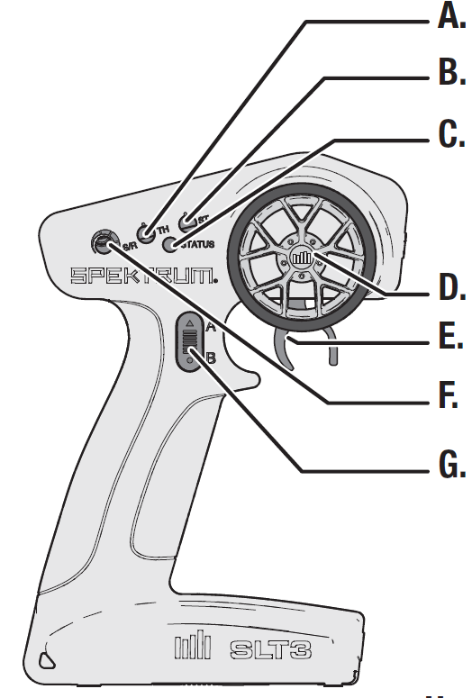

***Figure 11a**: Right diagram of the remote controller*

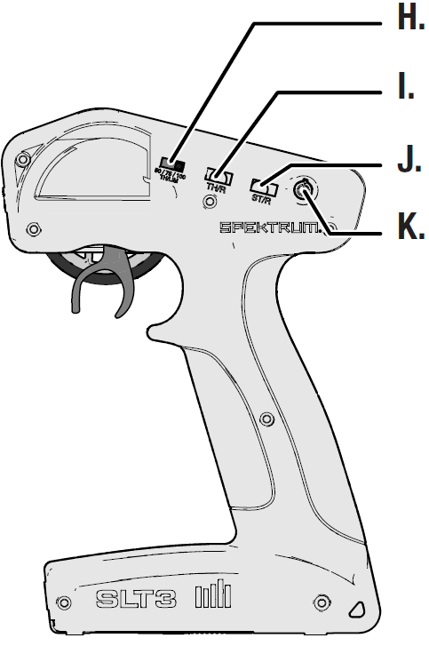

***Figure 11b**: Left diagram of the remote controller*

The robot's drivetrain uses a separate power source that is connected directly to the motor ESC. To power up the robot, **first** turn on the remote controller by pressing the Power Button (K), **then** turn the switch on the bottom of the chassis to the ON position.

By default, pull the throttle towards you to go forward, and push the throttle away to brake and reverse. In order to steer the truck, you need to rotate the steering knob by the desired amount. You can invert the throttle and steering using the corresponding (I, J) switches.

We use a [Maestro 6-Channel USB Servo Controller](https://www.pololu.com/product/1350) to control the motor ESC and steering servo. The running documentation of this servo controller can be found [here](https://www.pololu.com/docs/0J40). You can access the GUI interface of the controller from the command line:

```bash
cd ECE346/assets/maestro-linux/
./MaestroControlCenter
```

We have provided you with a ROS wrapper of the Maestro Servo Controller API. It subscribes to a ROS topic and sends inputs to the controller. Due to safety concerns, the multiplexer switch automatically disables the control signal from the Mastero Servo Controller. 

**Important: In order to drive the robot with Jetson, you need to press the Down button of Channel 3 (G) all the time**. The system will immediately switch to the remote controller mode if you release this button.

### Task 6.5: Launch Your Program on Mini Truck ###
Launch your own decision-making algorithm by  navigate to your laptop's workspace, activate the conda ROS environment and configure network setups, and finally, launch your node. Remember to press the Down button as described in the previous section to test your algorithm.:
```bash
cd ECE346/ROS_Core
conda activate ros_base
source network_ros_client.sh <ROBOT_IP> <LAPTOP_IP>
source devel/setup.bash
roslaunch lab1 lab1_truck.launch
```

**Important**: Due to differing ESC calibrations within our fleet, you may find that your truck is completing your tasks while driving in reverse (lol). If this is the case, open your **RQT** window and navigate to the **Dynamic Reconfigure** page (**Figure 12**). Select **servo_control...** and click on the **throttle_dir** parameter. This reverses your throttle control and the car should behave as expected! 

**In future labs** you may have to tune your mini truck by adjusting the parameters in the **Dynamic Reconfigure** window.

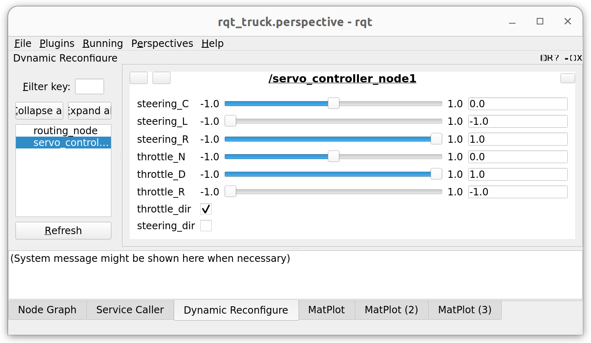
***Figure 12**: Dynamic Reconfigure window: tune your mini truck!*

**Once you are finished, demo your robot (in-person or via video recording on the F111 track) to a lab TA.**

## TL;DR: How to Launch Future Labs

Open a terminal, SSH into your mini truck, and run the start up script. This should take ~60-90 seconds.
```bash
ssh nvidia@192.168.1.XX
cd ~/StartUp
./start_ros.sh 192.168.1.2XX
```
Open a second terminal,
navigate to `ROS_Core`, activate the conda ROS environment, source the set up environment script, source the network configuration script, and launch visualization nodes by running:
```bash
 # Navigate to ROS_Core
cd <Path of your repo>/ECE346/ROS_Core 
# Start virtual environment
conda activate ros_base 
# Optional: Build ROS packages (if new packages)
catkin_make 
# Set up laptop environment
source devel/setup.bash
# Set up laptop ("client") network config
# Check with: "hostname -I" in case laptop ip has changed
source network_ros_client.sh <ROBOT_IP> <LAPTOP_IP>
# Launch visualization nodes
roslaunch racecar_interface visualization.launch
```
Navigate to **Service Caller**, choose **/SLAM/start_slam**, and click **call**.

Open a third terminal, cd into your ECE346 ROS workspace, complete the typical ROS environment set up, and launch your nodes!
```bash
 # Navigate to ROS_Core
cd ECE346/ROS_Core
# Start virtual environment
conda activate ros_base
# Optional: Build ROS packages (if new packages)
catkin_make
# Set up laptop environment
source devel/setup.bash
# Set up laptop ("client") network config
source network_ros_client.sh <ROBOT_IP> <LAPTOP_IP>
# Launch ROS nodes e.g. use lab1 and lab1_truck.launch 
roslaunch <ROS_Package> <Launch_File>
```
To find available ROS packages, run `rospack list | grep /path/to/ECE346/`. Note `conda` needs to be activated to recognize `rospack`. 

### Common Issues ###

This lab depends on several external packages, such as [pySpline](https://github.com/mdolab/pyspline) and [networkx](https://networkx.org/). If you encounter **Cannot find module** errors, try to use install those packages with this [script](/Host_Setup/ros_conda_install_unix.sh).

```bash
cd ECE346/Host_Setup
source ros_conda_install_unix.sh
```

### References and Additional Materials ###

Over the previous sections, we have covered a tiny portion of what ROS offers. Throughout the semester, we will learn more topics while implementing exciting algorithms on robots. We also encourage you to go over some of the excellent ROS tutorials and examples available online. You may find these materials very useful for gaining a deeper and more advanced understanding of ROS. Below are a few pointers to get you started on your ROS journey.

* [Official ROS documentation](http://wiki.ros.org/Documentation)

* [ROS tutorial from Clearpath Robotics](http://www.clearpathrobotics.com/assets/guides/melodic/ros/)

* [ROS lecture notes from ME495 at Northwestern University](https://nu-msr.github.io/me495_site/)

* [A Gentle Introduction to ROS by Jason M. O'Kane](https://www.cse.sc.edu/~jokane/agitr/agitr-letter.pdf)


If you encounter issues, bugs, or unsolvable puzzles, your best helper is always Google (much wiser than any one of us). If your questions are ROS-related or you are unsure how to achieve some advanced features, you can check [ROS Answers](https://answers.ros.org/questions/), where you are most likely to find solutions to your problems.

