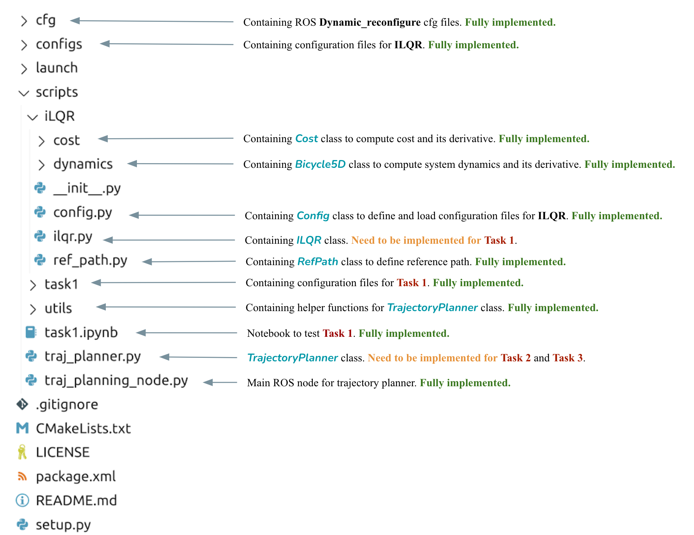
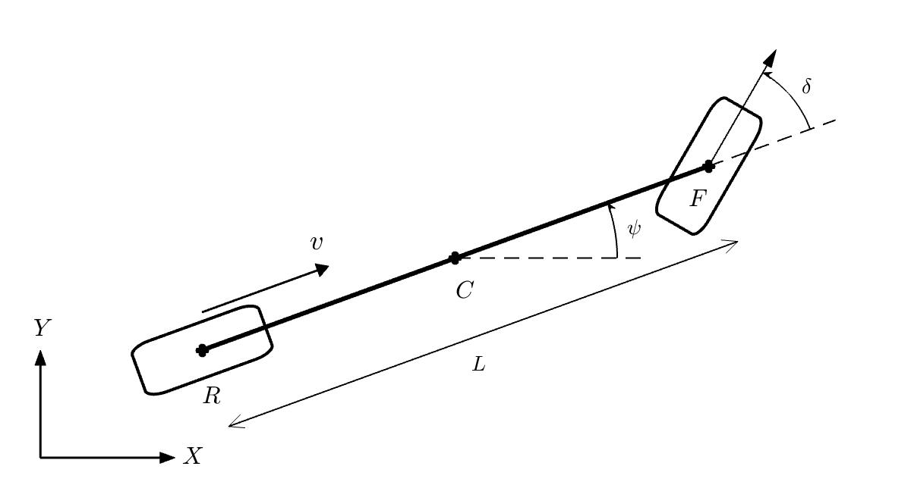
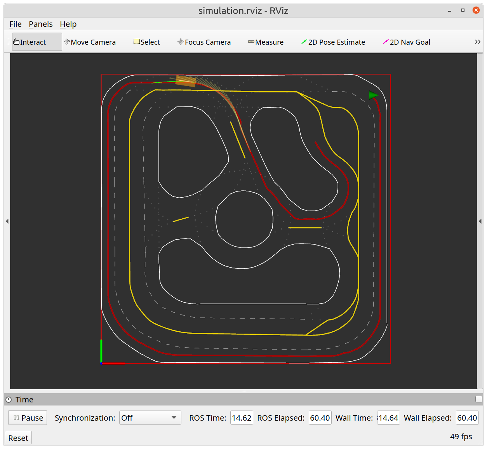
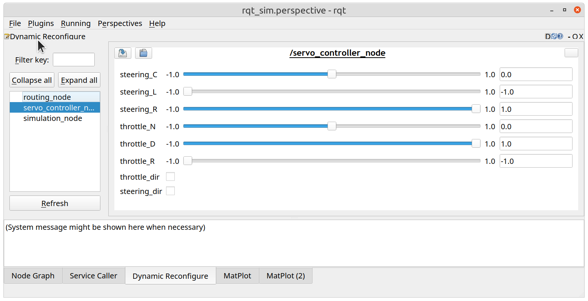

# Lab 2 - Trajectory Planning with ILQR

**[Due 11:59PM Thursday, February 27]**

This lab will focus on the fundamental robot trajectory planning problem using optimization-based methods. We will first express the trajectory planning problem as an optimal control problem and look into vehicle models that govern our robot's equations of motion. Then, we will utilize the iterative linear quadratic regulator (ILQR) to generate locally optimal trajectories and policy. In addition, we will design a receding horizon trajectory planner using your ILQR and test them on the simulator and the real robot.
    
There are **4 tasks** and **2 checkpoints** in this lab, and you will need to submit (push) your results and demonstrate them to a lab TA before **11:59PM February 27, 2024**.

# Getting Started #
**Note**: Make sure you have **pulled the code from upstream** into your repository and **updated all submodules**, i.e.,
```bash
git pull upstream 2025 --recurse-submodules
```

If you encounter the `ModuleNotFoundError`, please install missing packages using `mamba install <package_name>` under the `ros_base` environment. For example, to fix `ModuleNotFoundError: No module named sklearn`, you can use `mamba install scikit-learn`. 

## Software Structure
In this lab, you will build a trajectory planner for our robot. Specifically, we will develop the `racecar_planner` ROS package under the directory [ROS_Core/src/Labs/Lab2](https://github.com/SafeRoboticsLab/ECE346/tree/SP2025/ROS_Core/src/Labs/Lab2). The basic software structure can be found in **Figure 1**.



***Figure 1**: Software Structure for Lab 2*

We will implement the ILQR algorithm in the [`ILQR`](https://github.com/SafeRoboticsLab/ECE346/blob/SP2025/ROS_Core/src/Labs/Lab2/scripts/ILQR/ilqr.py#L17) class and test it in the Jupyter Notebook [`task1.ipynb`](https://github.com/SafeRoboticsLab/ECE346/blob/SP2025/ROS_Core/src/Labs/Lab2/scripts/task1.ipynb). Then, we will develop open-loop and receding horizon trajectory planning algorithms with ROS inside the [`TrajectoryPlanner`](https://github.com/SafeRoboticsLab/ECE346/blob/SP2025/ROS_Core/src/Labs/Lab2/scripts/traj_planner.py#L23) class. We will compare their performances in simulation and on the real robot.

## Trajectory Planning by Optimization
 We can formulate a trajectory planning problem as a discrete-time optimal control problem with a finite horizon $T$:

where we want to find a desired control sequences $u_{0:T} := (u_0, \cdots, u_T)$ that leads to a trajectory $x_{0:T} := (x_0, \cdots x_T)$, minimizes the cost $J$ over next $H$ steps.

## Robot Dynamics $f(x_t, u_t)$

Throughout this semester, we will use the kinematic bicycle model to describe the 2D motion of ground vehicles. As shown the **Figure 2**, instead of modeling all four wheels, we combine the front wheels as a single wheel at $F$, and represent both rear wheels as a single wheel at $R$. The steering angle $\delta$ is the angle between the front wheel and the longitudinal axis of the robot.



***Figure 2**: Kinematic Bicycle Model.*

 We assume the entire robot is a point mass at $R=\begin{bmatrix} X&Y \end{bmatrix}$ position, and the heading angle of the robot is $\psi$. The longitudinal velocity of the robot is $v$, and the steering angle is $\delta$. In addition, we also assume tires are under no-slip conditions so that both wheels' velocities align with their directions.
 
 Let us consider the state of robot $x = \begin{bmatrix}
X & Y & v & \psi & \delta
\end{bmatrix}^T$. Under the kinematic bicycle model, the system dynamics can be expressed as 
$\begin{equation}
    \begin{bmatrix}
        \dot{X} \\ 
        \dot{Y} \\ 
        \dot{v}\\
        \dot{\psi} \\
            \dot{\delta}
%       \dot{\delta}
    \end{bmatrix} = \begin{bmatrix}
        v\cos(\psi) \\
        v\sin(\psi) \\
        a\\
        \frac{v}{L}\tan(\delta)\\
            \omega
    \end{bmatrix}
\end{equation}$
where the system has control $u = \begin{bmatrix}
    a & \omega
\end{bmatrix}$ as $a$ is the longitudinal acceleration ($[m/s^2]$) and ${\omega}$ is the rate of steering ($[rad/s]$).\\

This kinematic bicycle dynamic has been implemented in the [`Bicycle5D`](https://github.com/SafeRoboticsLab/ECE346/blob/SP2025/ROS_Core/src/Labs/Lab2/scripts/ILQR/dynamics/bicycle5d.py#L8) class. 
In addition, we provide you with very efficient implementations of trajectory rollout and derivative using [Jax](https://jax.readthedocs.io/en/latest/). Specifically, you will find [`integrate_forward_np`](https://github.com/SafeRoboticsLab/ECE346/blob/SP2025/ROS_Core/src/Labs/Lab2/scripts/ILQR/dynamics/bicycle5d.py#L55) and 
[`get_jacobian_np`](https://github.com/SafeRoboticsLab/ECE346/blob/SP2025/ROS_Core/src/Labs/Lab2/scripts/ILQR/dynamics/bicycle5d.py#L73) useful for your ILQR. Please refer to their docstrings for instructions.

## Cost Function $c_t(x_t, u_t)$
One way to solve the optimal control problem posed above is using ILQR, which will find locally optimal control sequences by minimizing the cost function. Typical costs for our robot include deviation from the reference trajectory and velocity, penalties for large control values and collision, etc. By combining various cost functions with different weights, you can generate characteristic behaviors using your ILQR algorithm. As the example given in *Figure 3**, the ILQR finds a time-optimal trajectory in a racetrack, whose centerline and track boundary are provided.  

 generated by ILQR.](assets/traj_example.png)

***Figure 3**: Trajectory around [Motorsport Arena Oschersleben](https://www.racingcircuits.info/europe/germany/oschersleben.html) generated by ILQR.*

We have implemented a set of cost functions within the [`Cost`](https://github.com/SafeRoboticsLab/ECE346/blob/SP2025/ROS_Core/src/Labs/Lab2/scripts/ILQR/cost/cost.py#L13) class, whose parameters can be defined by your configuration file. The description of each cost function and its parameters can be found in the code. In addition, we provide you with very efficient implementation to obtain Jacobian and Hessian of the cost function using [Jax](https://jax.readthedocs.io/en/latest/). Specifically, you will find [`get_derivatives_np`](https://github.com/SafeRoboticsLab/ECE346/blob/SP2025/ROS_Core/src/Labs/Lab2/scripts/ILQR/cost/cost.py#L48) and [`get_traj_cost`](https://github.com/SafeRoboticsLab/ECE346/blob/SP2025/ROS_Core/src/Labs/Lab2/scripts/ILQR/cost/cost.py#L21) useful for your ILQR. Please refer to their docstrings for instructions.

**In Lab 2, cost parameters for all tasks are provided. You are certainly welcome but not required to fine-tune those parameters.**

### Task 1: Implementing ILQR Algorithm
Unlike the tasks you had in Lab 1, Task 1 is very open-ended. You will need to complete the main ILQR loop in the [`plan`](https://github.com/SafeRoboticsLab/ECE346/blob/SP2025/ROS_Core/src/Labs/Lab2/scripts/ILQR/ilqr.py#L133) function of [`ILQR`](https://github.com/SafeRoboticsLab/ECE346/blob/SP2025/ROS_Core/src/Labs/Lab2/scripts/ILQR/ilqr.py#L17) class following pseudocodes provided in the ILQR handout.

The `plan` function takes in **the initial state** $x_0$ and **optional initial control sequences** $\bar{u}_{0:T}$. After optimization using ILQR, it outputs a **dictionary** containing **planned trajectory** $x_{0:T}$, **control sequences** $u_{0:T}$, **feedback gain** $\{K_t\}$, and other information.

We have provided helper functions to compute cost and system rollout, as well as their derivatives. Detailed information can be found in **the comment block of `plan` function**. Once finished, test your planner with provided Jupyter Notebook [`task1.ipynb`](https://github.com/SafeRoboticsLab/ECE346/blob/SP2025/ROS_Core/src/Labs/Lab2/scripts/task1.ipynb) and show visualization results to a lab TA.

# ILQR as a Policy Planner

In Task 1, your ILQR generated a reference trajectory $x_{0:T}=\{\hat{x}_0,\cdots,\hat{x}_T\}$ and reference control $u_{0:T}=\{\hat{u}_0,\cdots,\hat{u}_T\}$ to complete the time trial on a racetrack. In addition, ILQR provides a local state feedback control policy to track the reference trajectory at each time step. For example, if the current state of the robot is $x_t$, the feedback control can be found as:
$
\begin{equation}
    u_t = \hat{u}_t + K_t(x_t - \hat{x}_t).
\end{equation}
$

### Task 2: Computing Feedback Control
We have implemented the function to attain polices to traverse along a reference path in the [`policy_planning_thread`](https://github.com/SafeRoboticsLab/ECE346/blob/SP2025/ROS_Core/src/Labs/Lab2/scripts/traj_planner.py#L344) function of the [`TrajectoryPlanner`](https://github.com/SafeRoboticsLab/ECE346/blob/SP2025/ROS_Core/src/Labs/Lab2/scripts/traj_planner.py#L23) class. In Task 2, you are asked to compute the robot's control as described in \autoref{eq: feedback_control} by completing the [`compute_control`](https://github.com/SafeRoboticsLab/ECE346/blob/SP2025/ROS_Core/src/Labs/Lab2/scripts/traj_planner.py#L192) function of the [`TrajectoryPlanner`](https://github.com/SafeRoboticsLab/ECE346/blob/SP2025/ROS_Core/src/Labs/Lab2/scripts/traj_planner.py#L23) class.

After finishing Task 2, you can test the ILQR within our simulated environment. Launch your ROS nodes using the following:
```bash
roslaunch racecar_planner ilqr_simulation.launch
```
After seeing `ILQR warm up finished` on your terminal, you can choose any point on the map using **2D Nav Goal** on your RViz. In **Figure 4**, we show an exemplary open-loop trajectory planned by the ILQR, where the red line is the reference path from the route planner and the green line is ILQR planned trajectory. Demonstrate your simulation results to a lab TA to check out Task 2.


***Figure 4a**: Example of Task 2 (Policy Planner) Results*



***Figure 4b**: Example of Task 3 (Receding Horizon Planner) Results*

# Receding Horizon Trajectory Planner with ILQR


Instead of computing the entire plan to track the reference path, we can utilize ILQR in a receding horizon fashion. Every time when the ROS node receives a new pose, we call ILQR to generate a new plan over a short horizon and use planned policy to generate controls.

### Task 3: Implementing the Receding Horizon Planner

In this task, you will need to finish the [`receding_horizon_planning_thread`](https://github.com/SafeRoboticsLab/ECE346/blob/SP2025/ROS_Core/src/Labs/Lab2/scripts/traj_planner.py#L409) function of the [`TrajectoryPlanner`](https://github.com/SafeRoboticsLab/ECE346/blob/SP2025/ROS_Core/src/Labs/Lab2/scripts/traj_planner.py#L23) class. You may find comment blocks inside this function helpful for your implementation. Once finished, test your receding horizon planner by launching:
```bash
roslaunch racecar_planner ilqr_simulation.launch receding_horizon:=true
```

After seeing `ILQR warm up finished` on your terminal, you can choose any point on the map using **2D Nav Goal** on your RViz and verify your receding horizon planner. Think about the advantages and disadvantages of the policy planner in Task 2 and the receding horizon planner in this task. **Share your thoughts with a lab TA and demonstrate your simulation**.

# Testing Your Planner on Mini-Truck

The modularity of ROS allows us to quickly deploy our algorithms from the simulated environment into the real robot with minimal changes to your code. As you did in lab 1, test your trajectory planner on the Mini Truck with the provided `ilqr_truck.launch`. You can use `receding_horizon` option to choose between policy planner and receding horizon planner.

Open a terminal, SSH into your mini truck, and run the start up script. This should take ~60-90 seconds.
```bash
ssh nvidia@192.168.1.XX
cd ~/StartUp
./start_ros.sh 192.168.1.2XX
```
Open a second terminal,
navigate to the `ROS_Core`, activate the conda ROS environment, source the set up environment script, source the network configuration script, and launch visualization nodes by running:
```bash
 # Navigate to ROS_Core
cd <Path of your repo>/ECE346/ROS_Core 
# Start virtual environment
conda activate ros_base 
# Optional: Build ROS packages (if new packages)
catkin_make 
# Set up laptop environment
source devel/setup.bash
# Set up laptop ("client") network config
# Check with: "hostname -I" in case laptop ip has changed
source network_ros_client.sh <ROBOT_IP> <LAPTOP_IP>
# Launch visualization nodes
roslaunch racecar_interface visualization.launch
```
Navigate to **Service Caller**, choose **/SLAM/start_slam**, and click **call**.

Open a third terminal, cd into your ECE346 ROS workspace, complete the typical ROS environment set up, and launch your nodes!
```bash
 # Navigate to ROS_Core
cd ECE346/ROS_Core
# Start virtual environment
conda activate ros_base
# Optional: Build ROS packages (if new packages)
catkin_make
# Set up laptop environment
source devel/setup.bash
# Set up laptop ("client") network config
source network_ros_client.sh <ROBOT_IP> <LAPTOP_IP>
# Launch ROS nodes, enable/disable receding_horizon
roslaunch lab2 ilqr_truck.launch receding_horizon=false
```



***Figure 5**: Update dynamic reconfigure parameters using RQT*

## Updating Parameters Using Dynamic Reconfigure
Due to hardware limitations, you might find it necessary to tune the direction and center point of the steering control, as well as the latency composition value to improve the performance of your plsanner on the robot. Instead of passing those values as ROS parameters, and setting them by re-launching, we can use **ROS Dynamic Reconfigure** to adjust them on the fly. Detailed tutorials on Dynamic Reconfigure can be found [here](http://wiki.ros.org/dynamic_reconfigure/Tutorials). You can adjust those parameters using RQT as shown in **Figure 5**.

### Task 4: Demonstrating ILQR Planner on Robot
Finally, test your planner on the mini-truck robot and **demonstrate its performance with a lab TA**.
