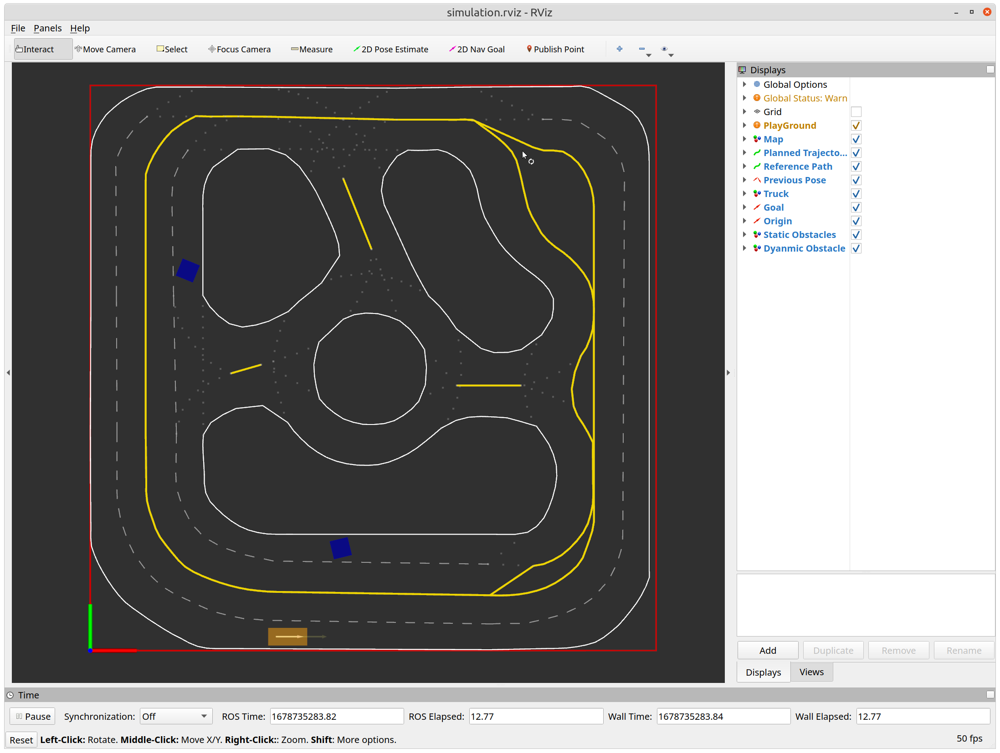
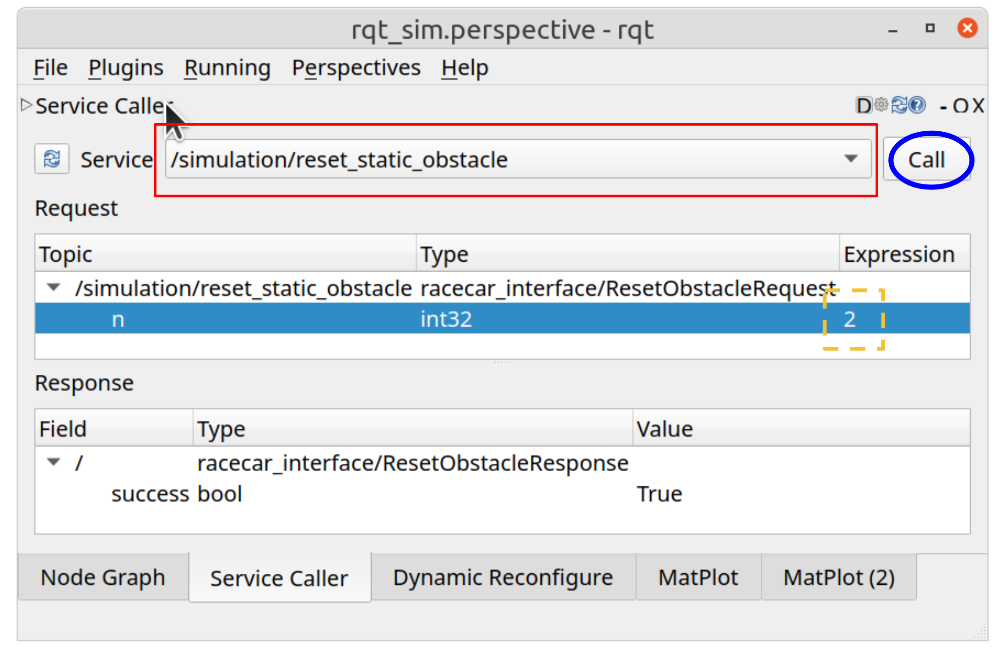
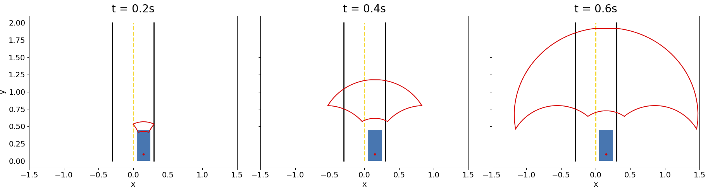
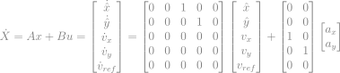
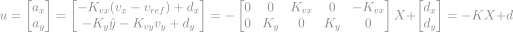
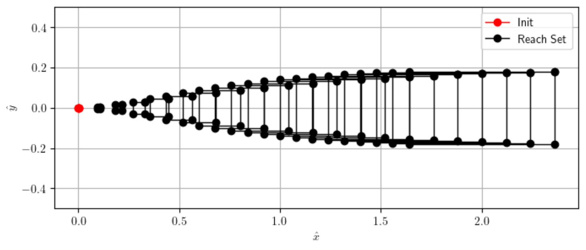
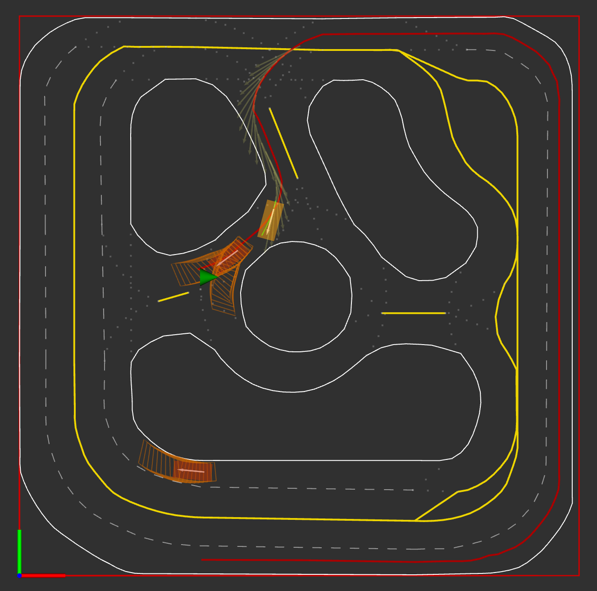
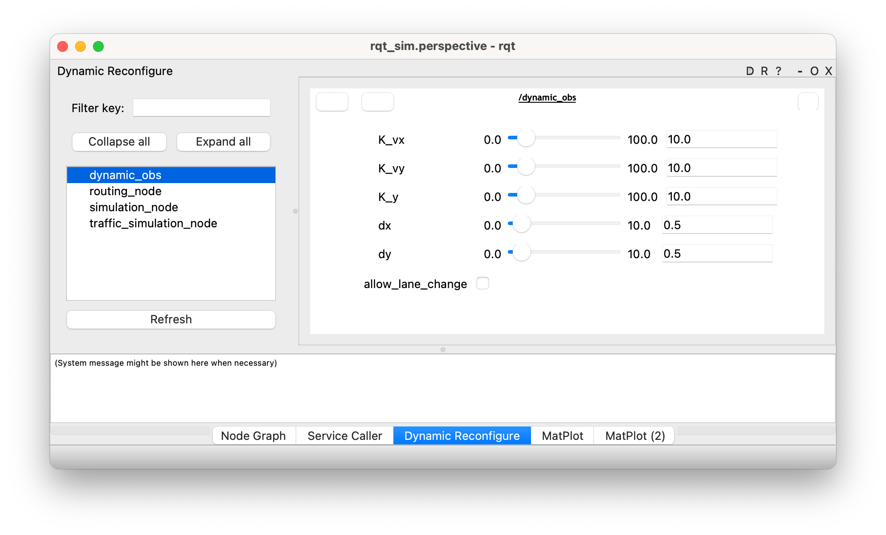
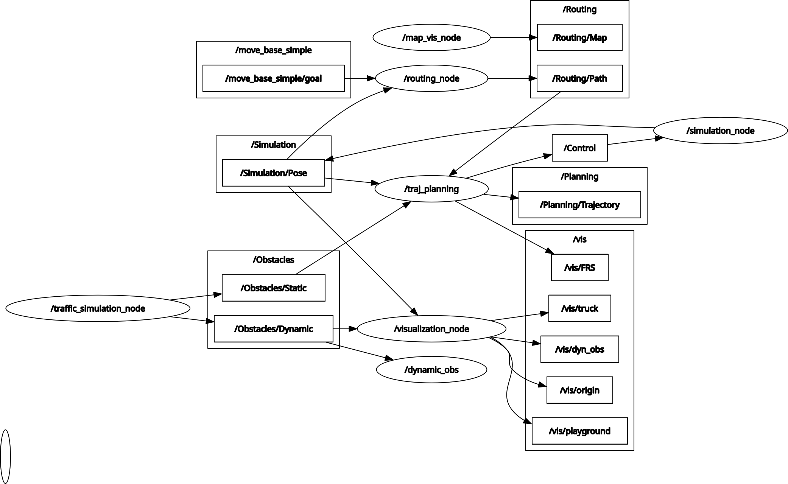
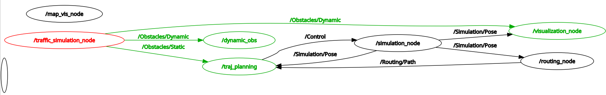

# Lab 3 - Collision Avoidance and Navigation in Dynamic Environment (Forward Reachable Set)
**[Due 11:59PM Thursday, March 20]**

In this lab, we will dive deeper into our ILQR trajectory planner. Specifically, we will introduce its new capability to avoid static and dynamic obstacles. First, we will build upon your Lab 2's result and allow your robot to navigate around static obstacles. Then, we will integrate forward-reachable sets to enable your robot to interact with other robots through a traffic simulator, with other cars joining the traffic with your robot.

There are **3 tasks** in this lab, and you will need to submit (push) your code and upload demo videos + comment to Canvas before **11:59PM March 6, 2025**.

**Note**: Make sure you have **pulled the code from upstream** into your repository and **updated all submodules**, i.e.,
```bash
git pull upstream SP2025 --recurse-submodules
```

# Getting Started #
In this lab, you will use your ILQR algorithm developed in the last lab to plan collision-free trajectories. A new node called `/traffic_simulation_node` is introduced in your workspace. This node (**Figure 1**) simulates static and dynamic obstacles and publishes them under topics `/Obstacles/Static` and `/Obstacles/Dynamic`. Your trajectory planner will leverage these messages and pass them into ILQR. To see the full changes of ROS nodes from Lab 2 to Lab 3, please refer to **Figure 8** and **Figure 9** in the Appendix.


***Figure 1**: `/traffic_simulation_node` is added to the ROS workspace in Lab 3 and it publishes the `/Obstacles/Static` and `/Obstacles/Dynamic` topics*

# Static Obstacles
In the first part of this lab, we will build collision avoidance functionality based on your ILQR. After activating ROS environment, rebuilding (`catkin_make`), and sourcing the workspace, we can launch the ROS nodes by running
```bash
 # Navigate to ROS_Core
cd ECE346/ROS_Core 
# Start virtual environment
conda activate ros_base 
# Optional: Build ROS packages (if new packages)
catkin_make 
# Set up laptop environment
source devel/setup.bash
# Launch nodes
roslaunch racecar_planner lab3_task1.launch num_static_obs:=2
```
This will launch a simulation environment (**Figure 2**) with two static obstacles (blue squares).



***Figure 2**: Simulated environment with two static obstacles*

## Task 1: Collision Avoidance with Static Obstacles
Recall that in Lab 2, we have implemented a receding horizon planner inside [`TrajectoryPlanner`](https://github.com/SafeRoboticsLab/ECE346/blob/SP2025/ROS_Core/src/Labs/Lab2/scripts/traj_planner.py#L23) class, we will add following features for this class:

### Adding the subscriber for static obstacles

1. Within your [`TrajectoryPlanner`](https://github.com/SafeRoboticsLab/ECE346/blob/SP2025/ROS_Core/src/Labs/Lab2/scripts/traj_planner.py#L23) class, read the **topic name** of static obstacles from the ROS parameter `~static_obs_topic` using the helper function `get_ros_param` and setting the default parameter as `/Obstacles/Static`.

2. Subscribe to the topic from step 1, with message type [`MarkerArray`](http://docs.ros.org/en/noetic/api/visualization_msgs/html/msg/MarkerArray.html). This message contained a list of obstacles represented by a marker.

    Hint: You can use `rosmsg show visualization_msgs/MarkerArray` to inspect the data structure of `MarkerArray` message.
    
    Hint: The callback function for this subscriber is a new one that is defined in step 4. You can call it static_obstacle_callback

3. Initialize an empty **dictionary** (let's call it `static_obstacle_dict`) as a [class variable](https://www.tutorialspoint.com/python/python_classes_objects.htm), i.e., a variable that is shared by all instances of a class (in this case, it is your `TrajectoryPlanner`).
4. Create a callback function for the subscriber. Inside this callback function, we retrieve **id** and **vertices** for each obstacle using [`get_obstacle_vertices`](https://github.com/SafeRoboticsLab/ECE346/blob/SP2025/ROS_Core/src/Labs/Lab2/scripts/utils/static_obstacle.py#L5) helper function. Then, **add vertices to `static_obstacle_dict` whose key is the id of the obstacle**.

5. **(Optional)** Feel free to implement any reset strategies for the dictionary inside your callback function. For example, you can clear the dictionary every time the callback function is called or clear it every few seconds.

### Passing static obstacles into ILQR
Inside the [`receding_horizon_planning_thread`](https://github.com/SafeRoboticsLab/ECE346/blob/SP2025/ROS_Core/src/Labs/Lab2/scripts/traj_planner.py#L409) function, 

1. At each time before replanning, initialize an empty list (let's call it `obstacles_list`).
2. Append all **values** from `static_obstacle_dict` into `obstacles_list`.
3. Pass `obstacles_list` into ILQR planner using `update_obstacles` function.

### Testing obstacle avoidance
Now re-launch ROS nodes and select a goal point on the map. 
```bash
 # Navigate to ROS_Core
cd ECE346/ROS_Core 
# Start virtual environment
conda activate ros_base 
# Optional: Build ROS packages (if new packages)
catkin_make 
# Set up laptop environment
source devel/setup.bash
# Launch nodes
roslaunch racecar_planner lab3_task1.launch num_static_obs:=2
```
The default parameter should be able to handle most static obstacles. If the robot is running off the corner, you will need to restart the simulation. If your robot is stuck and you have implemented a reset strategy in the optional Step 5, you can reset static obstacles using RQT ((**Figure 3**).

**(Submission)Please record a video of the truck successfully avoiding the 2 obstacles.**



***Figure 3**: Reset static obstacles by 1) selecting `/simulation/reset_static_obstacle` from drop-down menu 2) entering numbers of static obstacles into the **service expression** 3) clicking the `Call` button to send the service.*

# Dynamic Obstacles

In addition to static obstacles, we must consider other agents as dynamic obstacles and avoid collision with them. While we are unsure where other agents can be in the future, we can use forward reachable sets $\overrightarrow{\mathcal{R_t}}$ to model all possible future states and avoid them at each time step. Forward reachability analysis enables us to consider all possible states that the other agent will be in the future. Then, we can treat the forward reachable set (FRS) $\overrightarrow{\mathcal{R_t}}$ at each time instant as a static obstacle. We can use the same method in the previous section to incorporate the FRS information into the ILQR planner.

**Worst-Case Analysis.** We can compute the worst-case FRS concerning any possible controls. By avoiding FRSs at every time step within our planning horizon, your robot can avoid collision for any actions taken by other agents. However, this can make our planned trajectory very conservative and inefficient. For example, **Figure 4** shows the evolution of worst-case FRS. We can observe that worst-case FRS grows rapidly and occupies the entire road.



***Figure 4**: The evolution of the worst-case forward reachable set.*

**FRS with Predicted Policy.** Worst-case reachability analysis often leads to overly conservative planning. Thus, if we can acquire information about other agents' behavior, it is useful to incorporate it into our planning algorithm.
Suppose we have computed an estimate of another agent's control policy $\pi^o \colon X \to U^o$. (For example, we may have learned an estimate of the agent's preferences, expressed as a cost function and then computed an ILQR policy for this cost). We assume the uncertainty in other agent's behavior is well represented by an additive disturbance term $d^o_t$, i.e., 
    $x^0_{t+1} = f (x^o_t, \pi^o(x^o_t)) + d^o_t$
In this case, by avoiding FRSs at every time step within our planning horizon, the robot can safeguard against all possible disturbances.

## Linear System Approximation
We can use a simplified dynamical model to describe the motion of other agents. Assuming the agent follows a reference path and maintains a constant velocity, its continuous state-space model is:



Where $\hat{x}$ and $\hat{y}$ are longitudinal and lateral position along the reference path, $v_x$ and $v_y$ are longitudinal and lateral velocity, $a_x$ and $a_y$ are longitudinal and lateral acceleration, and $v_{ref}$ is the reference longitudinal velocity. The agent applies a simple feedback control policy:




 Putting **Equation 2** and **Equation 3** together, we have a new feedback control system as: 
 $\dot{X}=(A-BK)X+Bd$

 Using this formulation, we can obtain the FRS of other agents in [Frenet coordinates](https://fjp.at/posts/optimal-frenet/#:~:text=to%20the%20controller.-,Frenet%20Coordinates,road%20or%20a%20reference%20path), which can be transformed into Cartesian coordinates easily. For example, the FRS with predicted policy can be seen in **Figure 5**. This forward reachable set does not over-grow as timestep increases because our feedback policy can stabilize the system despite the disturbance.

 

***Figure 5**: 20 Steps forward reachable sets with predictive policy projected to* $\hat{x}$ - $\hat{y}$ *plane*

 ## Task 2: Multi-step Forward Reachable Set
 Inside the file `ROS_Core/src/Labs/Lab3/scripts/frs.py`, we have implemented the majority of functionalities to compute FRS in [`FRS`](https://github.com/SafeRoboticsLab/ECE346/blob/SP2025/ROS_Core/src/Labs/Lab3/scripts/frs.py) class. For example, given a set, $A$ and $B$ matrices to represent dynamics, bounds of control/disturbance, and time step $d_t$, [`onestep_zonotope_reachset`](https://github.com/SafeRoboticsLab/ECE346/blob/SP2025/ROS_Core/src/Labs/Lab3/scripts/quickzonoreach/zono.py#L17) function will calculate the FRS after $d_t$ seconds.

 You task is to finish [`multistep_zonotope_reachset`](https://github.com/SafeRoboticsLab/ECE346/blob/SP2025/ROS_Core/src/Labs/Lab3/scripts/frs.py#L10) function in the [`FRS`](https://github.com/SafeRoboticsLab/ECE346/blob/SP2025/ROS_Core/src/Labs/Lab3/scripts/frs.py) class following instructions. This function will calculate multiple-step reachable sets given an initial set.

 Finally, you can use [`ROS_Core/src/Labs/Lab3/scripts/task2.ipynb`](https://github.com/SafeRoboticsLab/ECE346/blob/SP2025/ROS_Core/src/Labs/Lab3/scripts/task2.ipynb) to reproduce **Figure 5**.


## Task 3: Collision Avoidance with Dynamic Obstacles

***Figure 6**: Example result of task 3*


In task 3, we will first create a new ROS node to host ROS Service Server that calculates the FRS. We will implement this node in [`ROS_Core/src/Labs/Lab3/scripts/dyn_obstacle_node.py`](https://github.com/SafeRoboticsLab/ECE346/blob/SP2025/ROS_Core/src/Labs/Lab3/scripts/dyn_obstacle_node.py) file. Specifically, we will:

1. Create a subscriber to get poses of other agents;
2. Create a Dynamic Reconfigure Server to allow you to adjust FRS parameters on the fly; 
3. Create a ROS service Server with the name `/obstacles/get_frs` to obtain other agents' FRSs on demand.
4. Initialize the ROS node to start the service server you just created.

Detailed instructions can be found in doc-strings. You will find ROS's official tutorials helpful for this task.

* [How to Write Your First .cfg File](http://wiki.ros.org/dynamic_reconfigure/Tutorials/HowToWriteYourFirstCfgFile)
* [Setting Up Dynamic Reconfigure For A Node in Python](http://wiki.ros.org/dynamic_reconfigure/Tutorials/SettingUpDynamicReconfigureForANode%28python%29)
* [Writing a Simple Service and Client in Python](http://wiki.ros.org/ROS/Tutorials/WritingServiceClient%28python%29)

Next, you **must also write a ROS Service Client** inside your trajectory planner. The general workflow is:

1. Create a [client](http://wiki.ros.org/ROS/Tutorials/WritingServiceClient%28python%29#rospy_tutorials.2FTutorials.2FWritingServiceClient.Writing_the_Client_Node) for `/obstacles/get_frs` service when the [`TrajectoryPlanner`](https://github.com/SafeRoboticsLab/ECE346/blob/SP2025/ROS_Core/src/Labs/Lab2/scripts/traj_planner.py#L23) class is initialized.
2. Create a publisher (let's call it `frs_pub`) to publish FRS information for visualization when the [`TrajectoryPlanner`](https://github.com/SafeRoboticsLab/ECE346/blob/SP2025/ROS_Core/src/Labs/Lab2/scripts/traj_planner.py#L23) class is initialized. This publisher publishes `MarkerArray` messages to the `/vis/FRS` topic.
3. Inside the [`receding_horizon_planning_thread`](https://github.com/SafeRoboticsLab/ECE346/blob/SP2025/ROS_Core/src/Labs/Lab2/scripts/traj_planner.py#L409) function, call the service client you created in Step 1. For example, you can do 

```python
request = t_cur + np.arange(self.planner.T) * self.planner.dt
response = Your_Service_Client(request)
```

4. Then process the response of your service call using the helper function [`frs_to_obstacle`](https://github.com/SafeRoboticsLab/ECE346/blob/SP2025/ROS_Core/src/Labs/Lab2/scripts/utils/dyn_obstacle.py#L7). The output of this helper function need to be **extended** into the `obstacles_list` (the same list you are using for task 1) before sending it to the ILQR planner. 

**Hint**: See [append() and extend() in Python](https://www.geeksforgeeks.org/append-extend-python/) to learn more about their difference.

5. Use the the helper function [`frs_to_msg`](https://github.com/SafeRoboticsLab/ECE346/blob/SP2025/ROS_Core/src/Labs/Lab2/scripts/utils/dyn_obstacle.py#L26) to generate visualization messages of FRSs. Publish the message with `frs_pub` that you created in step 2.


Finally, you can test your collision avoidance by launching ROS nodes:
```bash
 # Navigate to ROS_Core
cd ECE346/ROS_Core 
# Start virtual environment
conda activate ros_base 
# Optional: Build ROS packages (if new packages)
catkin_make 
# Set up laptop environment
source devel/setup.bash
# Launch nodes
roslaunch racecar_planner lab3_task2.launch
```
If everything works properly, you will see your robot moving around the track and avoid collisions with other agents.

Note: At different areas of the track (such as in the inner circle), your truck may swerve in either direction drastically to avoid the dynamic obstacle. This is completely normal behavior that is dictated by the costs of the obstacles in conjunction to the state and control cost. Therefore, tuning the costs of each is important in fixing these issues but is not expected of you until the final Lab.

You can also use RQT (**Figure 7**) to adjust FRS parameters, as described in the previous sections. What will happen if you increase $d_x$ and $d_y$ and set all $K$ terms to 0? **Please upload your observations (e.g., as a comment or separate document) in your final submission on Canvas**.

**Submission:**

1. Video of truck successfully avoiding 2 static obstacles and continuing its path
2. Video of truck succcesfully overtaking or avoiding a dynamic truck once
3. Document answering the above quesiton about** $d_x$, $d_y$ and $K$



***Figure 7**: You can use RQT to setup Dynamic Reconfigure Parameters for FRS*

# Appendix



***Figure 8**: New nodes and topics in lab 3*



***Figure 9**: New nodes and topics in lab 3*
