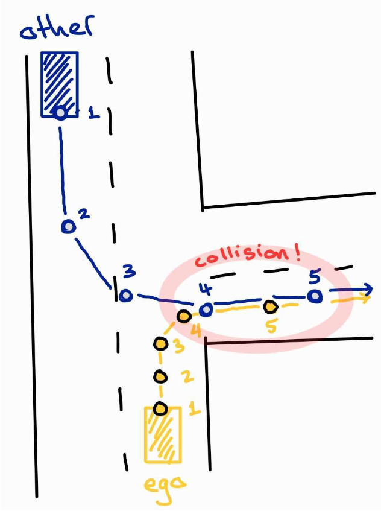
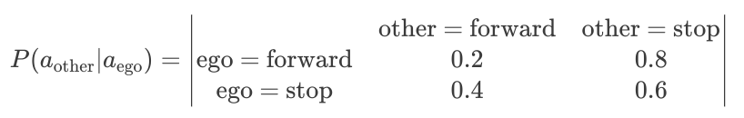
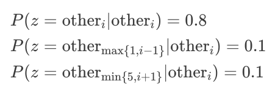

# Lab 4: MDP and POMDP
**[Due 11:59PM Thursday, April 3]**

This lab will focus on using **Markov Decision Processes (MDPs)** and **Partially Observable Markov Decision Processes (POMDPs)** in solving robot planning problems. In doing so, it helps us practice with the following:
* Modeling a real-world example of T-intersection negotiation using MDPs and reward functions
* Applying definitions (like value functions and policies) and algorithms (like value iteration and policy iteration) to solve reward-based MDP planning problems
* Generalizing our approach to POMDP problems, using QMDP and Bayesian inference to approximate as if we will have full knowledge of the robot's state in the next time step


**Note**: Please make sure you have **pulled the code from upstream** into your repository and **updated all submodules**:
```bash
git pull upstream SP2025 --recurse-submodules
```

# Getting Started

MDPs and POMDPs can help solve problems in probabilistic planning and control. The difference between the two is the notion of **observability**:
* In an MDP, the states are **fully observable** (the state of the entire system can be completely inferred from sensor-based observations) and only dynamics are uncertain.
* On the other hand, POMDPs help solve problems with **partial observability** (uncertainty in both dynamics and perception), by replacing the current state with the current **belief**, a distribution over possible current states. Successive observations help us refine this belief.

The first part of the lab will consist of **3 sub-tasks (MDP formulation, Value/Policy Iteration, Simulation)**. It will help you to construct a fully observable MDP for a T-intersection problem, then write *value iteration* and *policy iteration* routines to derive and simulate an optimal policy that negotiates turning right when the other car wants to turn left.

The second part of the lab consists of **3 sub-tasks (MDP formulation, QMDP, Belief Update)**. It will help you construct a partially observable MDP for the same problem, then use the *QMDP algorithm* to approximate the solution (rather than solving it directly), by updating the belief and calculating the next actions that would be best to take. As you change the reward function and transition function of the fully observable MDP, consider how these changes will affect the final rollout of the negotiation process.

Refer to this lab's Jupyter Notebook [`pomdp.ipynb`](./pomdp.ipynb) and docstring to get started, and read the following sections for a more in-depth overview of the individual sub-tasks.

# T-intersection negotiation MDP

## Task 1.1: MDP formulation

### Background on the MDP class

In this task you will first formulate the MDP used to represent the T-intersection problem. To simplify the process, we have created the `MDP` class for you (see [`mdp.py`](./mdp.py)). To initialize the MDP, create an MDP object from the respective class with the following information:

```py
mdp_object = MDP(
    states = [
        [state_variable_1],
        [state_variable_2],
        [...]
    ],
    actions = [action_1, action_2, ...],
    r = -1 # default reward,
    method = method # default to "replace"
)
```

Here, `method` $\in \text{\{replace, add\}}$ helps determine how the routing probability will solve conflicts between two similar `MDP.add_route()` prompts.

The MDP will then use your input states and actions to create an empty matrix of P and R. The matrix has the following structure:
```py
# P[new_state, current_state, action] = probability
mdp_object.P.shape = (NUM_STATES, NUM_STATES, NUM_ACTIONS)
# R[state, action] = reward, default to -1
mdp_object.R.shape = (NUM_STATES, NUM_ACTIONS)
```

The following is a list of internal variables of this class that you can access:
```python
MDP().a             # list of actions
MDP().s             # list of state variables
MDP().num_s         # number of state
MDP().num_s_vars    # number of state variables
MDP().num_a         # number of action
MDP().P             # transition matrix
MDP().R             # reward matrix
```    

The following functions are supported in this class:

```python
# Add new route (transition) to current MDP object
# If method is set to "replace", p = p_new
# Else if method is "add", p = p + p_new
add_route(current_state, action, new_state, p=1.0)

# Add new reward to current MDP routes
add_reward(state, action, reward)

# Get state indexing in MDP().P and MDP().R
get_index(state)

# Get state in index form from index
get_state(index)

# Get state in real state variable value from from index
get_real_state_value(index)

# Get basic MDP information
# Output: num_a, num_s, R, P
get_mdp()
```

The class `MDP` will help you to index and manage routes and rewards within the MDP more easily. In a toy example, where you have an MDP with 2 state variables $s_1 \in \{\text{restaurant, supermarket}\}$ and $s_2 \in \{\text{vacant, full}\}$, and 4 different actions $a=\{\text{left, right, forward, backward}\}$, simply create and index your MDP as follows:

```python
mdp_object = MDP(
    states=[
        ["restaurant","supermarket"], # s_1
        ["vacant","full"]             # s_2
    ],
    actions=["left","right","forward","backward"] # a
)

'''
To add a new transition (with probability 0.8) from s_cur=[restaurant,full] to s_new=[supermarket,vacant] when taking action a=forward, simply call:
'''
mdp_object.add_route(
    current_state = ["restaurant","full"], 
    action = "forward", 
    new_state = ["supermarket","vacant"],
    p = 0.8
)
```

Let's use a simple example of a 2-state MDP to show how this class works.

```python
class TwoStateMDP(MDP):
    def __init__(self):
        self.states = [["s1", "s2"]]
        self.actions = ["a0", "a1"]
        self.gam = 0.9
        
        # call the parent class
        super().__init__(
            states=self.states,
            actions=self.actions
        )
        self.populate_data()
    
    def populate_data(self):
        # add all routes from s1
        self.add_route(["s1"],"a0",["s1"])
        self.add_route(["s1"],"a1",["s2"])
        # add all routes from s2
        self.add_route(["s2"],"a0",["s2"])
        self.add_route(["s2"],"a1",["s2"])
        # populate the reward
        for a in self.a:
            self.add_reward(["s1"],a,0.5)
            self.add_reward(["s2"],a,1.5)
```

We could test some internal functions of class MDP:
```python
twoStateMDP = TwoStateMDP()
print(twoStateMDP.get_index(["s1"]))
print(twoStateMDP.get_state(0))
print(twoStateMDP.get_real_state_value(0))

# Output
>>> 0
>>> [0]
>>> ['s1']
```

### T-intersection MDP
Your task is to use our MDP class to create the MDP based on the following figure:



The T-intersection problem has 2 cars: our car, called `ego`, and the other car, called `other`. The state is `s = {ego_i, other_j}`, with `i` and `j` both between 1 and 5, inclusive. This includes where we are our trajectory (in yellow) and where the other car is on its own trajectory (in blue). The action space has 2 actions: `forward` and `stop`. The following information describes our MDP:

Our choice of action affects the other car's action as follows:


For example, if we take the action `forward`, there is a `0.8` chance that the other car will `stop`, and `0.2` chance that both cars will move forward.

The dynamics are described as follows:
* When moving forward with action `forward`, for each car there is a `0.8` chance of moving 1 step ahead, and a `0.2` chance of moving 2 steps ahead.
* When choosing action `stop`, the car will stop with probability `1.0`.
* The system terminates when either car reaches the goal, i.e. `ego_i = ego_5` or `other_i = other_5`, or when collision happens, i.e. `s = {ego_i, other_j}` with `i` and `j` both between 4 and 5, inclusive.

The reward function is as follows:
* `a = forward`: reward `-1`.
* `a = stop`: reward `-5`.
* Reaching the goal gives reward `+5`.
* A collision gives reward `-10`.

In the provided [Jupyter Notebook](./pomdp.ipynb), you will see the docstring for task 1.1. Compute the state transition probability and fill in the missing `p` values for each `MDP.add_route()` command.

## Task 1.2: Value iteration and policy iteration
Your next task is to write value iteration and policy iteration for the MDP that you have just created.

Refer to the docstring in your [Jupyter Notebook](./pomdp.ipynb) for task 1.2. To check if your implementation of value iteration and policy iteration is correct, we provide you with a closed-form solution for the simple two-state MDP. Once you finish implementing it, run the test cases provided to check if your calculated `V_star(x)` and `pi_star(x)` match the closed-form solution.

## Task 1.3: Simulate your computed $\pi^*(x)$
We provide you with a visualizer class for the T-intersection problem located in [visualizer.py](./visualizer.py). The class `TIntersectionVisualizer` has a function `TIntersectionVisualizer.plot()` that takes parameter `state` and gives you the visualization of the system at that state.

From the `V_star` and `pi_star`S in task 1.2, using the provided visualizer, do the following tasks:
* Choose an initial state.
* Iterate from the initial state until you reach a terminal condition (reach goal or in collision).
* Maintain a list of all states that you have visited.
* Use the provided visualizer and function to plot all figures of each recorded state and create a GIF.

# T-intesection QMDP

Let us now turn this problem into a POMDP one. Assume that we have the same T-intersection negotiation problem as our underlying MDP, but this time the state is *not fully observable*, in the sense that we always know where we are, but *we do not know where the other car is*. The following modifications are added to our old MDP:
* Add in a new action `look`, with the following characteristics:
  * When taking the `look` action, we will receive reward `-1`
  * When the action is `look`, the new state is the current state with probability `1.0`
  * After apply action `look`, we receive an observation $z$ corresponding to where the other car is, with probabilities:
    

We can approximate the POMDP solution with **QMDP** by computing the value function of the underlying MDP **offline** before doing online QMDP. Following Section \ref{qmdp-background}, the state value $\hat{V}$ of this MDP can be used in QMDP later.

As our belief is the probability of where the other car is, we can use Dirichlet-mulinomial model to gradually update our belief, by treating this similar to the 5-face dice toss problem.

## Task 2.1: Defining the POMDP problem
Follow the docstring in the Jupyter Notebook to create a new MDP for T-intersection negotiation problem with extra action `look`, additional state transition information and reward.

## Task 2.2: QMDP
For this task you will attempt to calculate $\hat{V}$ using the same value iteration that you have written in Task 2.

Next, you will implement QMDP as described in the [QMDP background](#qmdp). Your QMDP should return a single action every time. Use the docstring in Jupyter Notebook to finish this task.

## Task 2.3: Observation and belief space
For this task you will create a [Diriclet-multinomial model](#dirichlet-multinomial-model) that uses Bayes' Theorem to recompute your predictive posterior.

Once you have built your Dirichlet-multinomial model, run the last block code in your Notebook to see how everything is connected. Does the result make sense?

# Background

Please view the following PDF on Github to review the basic concepts of MDP and POMDP that might be useful for this lab:

[ECE346 Lab 4 Background](./assets/ECE346_Lab4_Background.pdf)