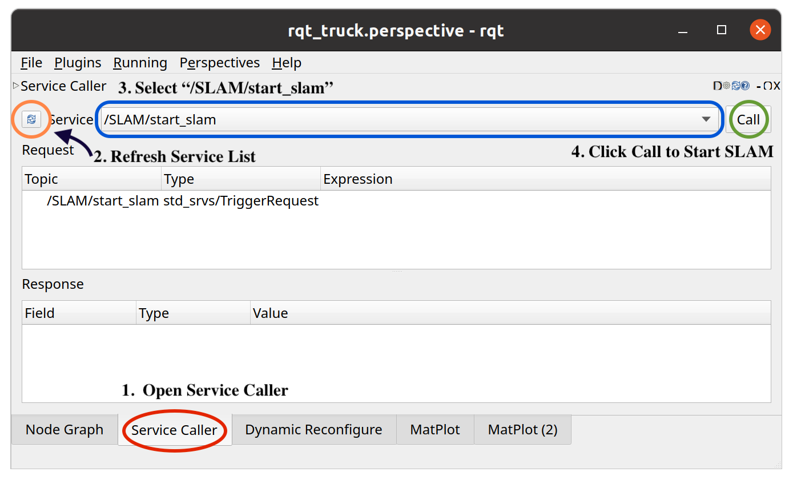
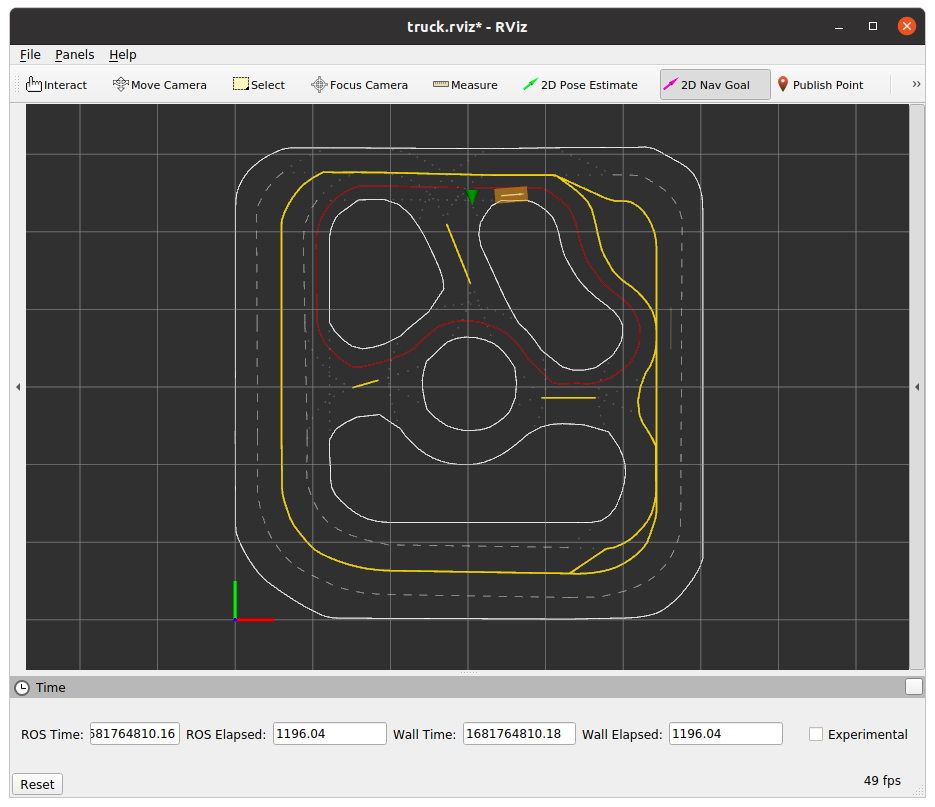

# Lab 4: Behavior Cloning
In this lab, we will use a basic behavior cloning algorithm to train a model to drive the truck.


**Make sure that your repo is up-to-dated**
# Setup Environment
## 1. Open a new terminal and SSH into your robot
```
ssh nvidia@<IP OF YOUR ROBOT>
```
## 2. Activate *ros_base* environment on your robot
```
conda activate ros_base
```
## 3. Install Pytorch
```
pip3 install torch
```

# Launch Learning Node
## Open **three** new terminals and let's call them *T1*, *T2*, and *T3*
### 1. In *T1*, SSH into your robot and launch SLAM
```
ssh nvidia@<IP OF YOUR ROBOT>
cd ~/StartUp
./start_ros.sh <IP OF YOUR ROBOT>
```
### 2. In *T2*, navigate to the repo on your PC
```
cd <REPO ON YOUR PC>/ROS_Core
conda activate ros_base
catkin_make
source devel/setup.bash
source network_ros_client.sh <IP OF YOUR ROBOT> <IP OF YOUR PC>
roslaunch racecar_interface visualization.launch enable_routing:=false
```
### 3. Start the SLAM from RQT

### 4. In *T3*, SSH into your robot and start learning node
```
ssh nvidia@<IP OF YOUR ROBOT>
cd <REPO ON YOUR ROBOT>/ROS_Core
conda activate ros_base
catkin_make
source devel/setup.bash
source network_ros_host.sh <IP OF YOUR ROBOT>
roslaunch racecar_learning lab4.launch
``` 

# Start Training Online
## 1. In the RQT, call the service *"learning/start_learn"* from RQT to start training. 
## 2. In the RVIZ, use the *"2D Nav Goal"* to set a reference path for the robot
A loop will be generated automatically as your robot's reference path, use your controller to drive the robot along the path.

## 3. In *T3*, you will see the loss be printed out.
You can drive your robot along the reference path for a few loops, then simply let the robot stop on the track and wait the loss to converge.
## 4. Once the loss converges, call the service *"learning/eval"* from RQT to pause the training and evalute the model.
Hit the down button on your controller to start the evaluation. The robot will drive along the reference path.
## 5. If the robot drives well, call the service *"learning/save_model"* from RQT to save the model and call the service *"learning/save_data"* to stop the training.
Your model will be saved in folder ["ROS_Core/Labs/Lab4/models"](./models) on your robot, and the training data will be saved in folder ["ROS_Core/Labs/Lab4/data"](./data) on your robot.
## 6. If you do not like your model, call the service *"learning/start_learn"* again from RQT to resume training again.

# Traning Offline
With data collected from the previous step, we can train the model offline using provided [iPython notebook](./scripts/offline_train.ipynb). You can train this on your own PC, which should be significantly faster than the computer on the robot.

# Test the Model
You can evaluate the model trained offline by using additional parameter during the launch of the learning node. In *T3*, relaunch the node using 
```
roslaunch racecar_learning lab4.launch model_path:=<PATH TO YOUR MODEL>
```

# Task: Train your own behavior cloning policy, test it on the robot and show it to your AIs

