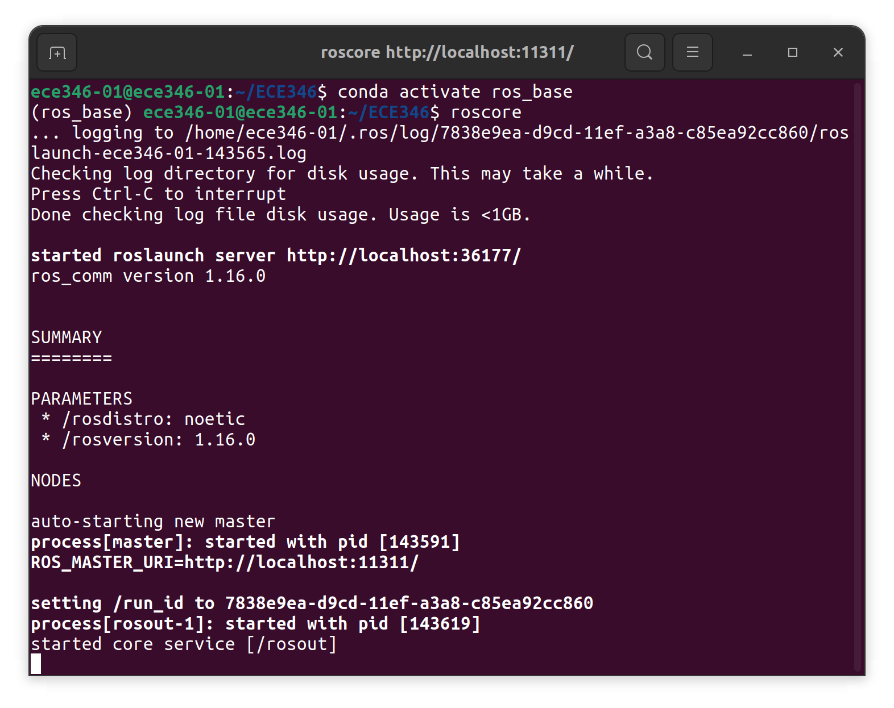
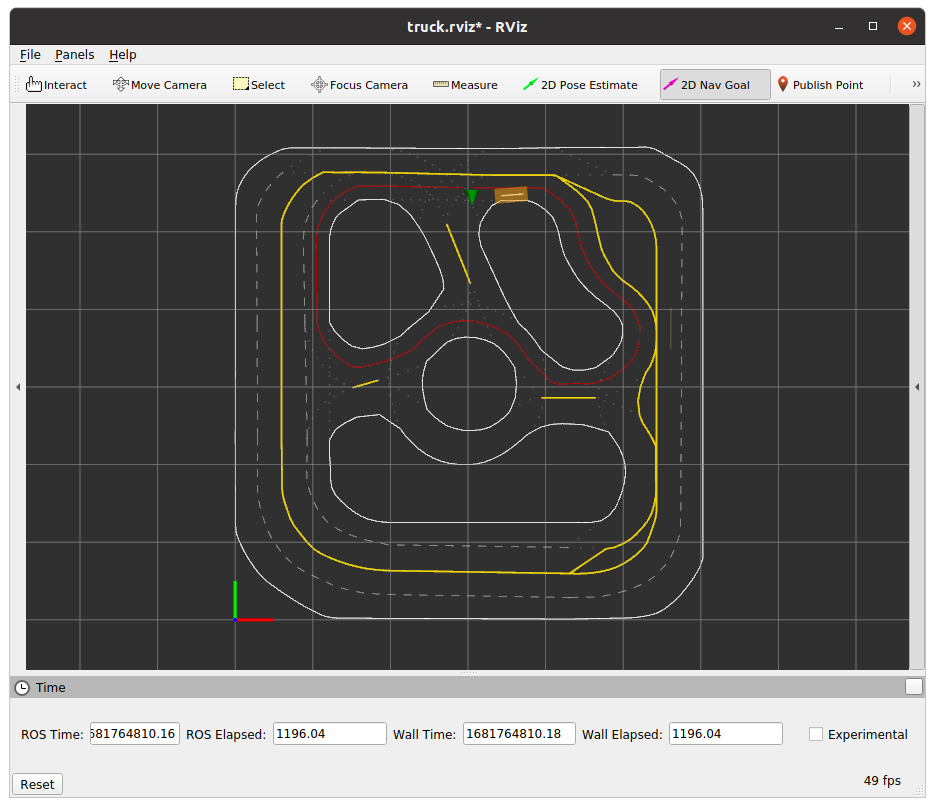

# Lab 5: Imitation Learning
**[Due 11:59PM Thursday, April 10]**

In this lab, we will use a basic imitation learning (behavior cloning) algorithm to train a model to drive the robot around a loop.

There is **1** task in this lab, and you will need to submit (push) your code and upload a demo video to Canvas before **11:59PM April 10, 2025.**

**Note:** Make sure you have **pulled the code from upstream** into your repository and **updated all submodules**, i.e., 
```bash
git pull upstream SP2025 --recurse-submodules
```

# Getting Started
## Clone your ECE346 repo to your Robot
First, you will need to clone your ECE346_GroupXX repo to your Robot.

1. Open a new terminal and SSH into your robot.
    ```bash
    ssh nvidia@<IP OF YOUR ROBOT>
    ```
2. In the robot terminal, run the following command in your root directory (``cd ~``). **Important:** ``--recurse-submodules`` is necessary to get all submodules, i.e., linked specific commits of separate GitHub repositories!
    ```bash
    git clone --recurse-submodules https://github.com/SafeRoboticsLab/ECE346.git
    ```
3. From inside the cloned directory, rename the original ```ECE346``` GitHub repo to `upstream` (default is `origin`), which you'll use to fetch future lab assignments and updates.
    ```bash
    cd ECE346
    git remote rename origin upstream
    git remote set-url --push upstream DISABLE
    ```
4. Add your group's private repository as a new remote named ``origin``. Note, this is just the typical name for the 'primary' remote (online repository). To locate your private repo's URL, navigate to its main paige on GitHub, select the green ``<> Code`` icon, select SSH, and copy this URL to your clipboard.
    ```bash
    git remote add origin <URL of your private REPO>
    ```
5. Complete your GitHub configuration in your terminal. 
    ```bash
    # Replace with your GitHub email address and full name or a fun alias ;). Note this will appear on GitHub
    git config user.email "your_email@example.com"
    git config user.name "Your Name"
    ```
    **Note:** run the commands above inside your ECE346 directory after setting the URL to your remote repository. Otherwise, you'll get the error ``fatal: not in a git directory``.

6. Pull the SP2025 branch of your private, remote repository to your new, local one on the truck.
    ```bash
    git pull origin SP2025
    ```

## Set up ROS Environment via RoboStack
To set up the ROS environment on your truck, run in your terminal:

```bash
cd ~/ECE346
sudo apt install curl
cd Host_Setup
chmod +x ros_conda_install_unix.sh
./ros_conda_install_unix.sh
```
This process should take ~5 minutes. If you do not have conda (anaconda/miniconda/miniforge, etc.) installed, the script will first install [**miniforge**](https://github.com/conda-forge/miniforge), and then create a new Python 3.9, ROS Noetic environment. Otherwise, it will install [**miniforge**](https://github.com/conda-forge/miniforge) in parallel with your current conda, and then create a new ROS Noetic environment.

We create an alias for activating the new environment called ```start_ros```. You can activate the environment by running either `start_ros` or `conda activate ros_base`.

## Test it out
Activate your ROS environment on the robot by running `start_ros`.

Then run `roscore` to start the ROS master. If everything works, you will see


## Install PyTorch and tqdm
Next, you'll need to install ``PyTorch`` on both your robot and laptop, as well as ``tqdm`` on your robot. First, we'll do the robot:
1. Open a new terminal and SSH into your robot.
    ```bash
    ssh nvidia@<IP OF YOUR ROBOT>
    ```
2. Activate the *ros_base* environment on your robot.
    ```bash
    conda activate ros_base
    ```
3. Install PyTorch.
    ```bash
    pip install torch
    pip install tqdm
    ```
Then, do it again for your laptop.
1. Open a new terminal. Activate the *ros_base* environment on your laptop and install PyTorch.
    ```bash
    conda activate ros_base
    pip install torch
    ```

# Launch the Learning Node
To begin behavior cloning, close all pre-exiting terminals and open **three** new ones. We will call them ***T1***, ***T2***, and ***T3***.
1. In *T1*, SSH into your robot and launch SLAM.
    ```bash
    ssh nvidia@<IP OF YOUR ROBOT>
    cd ~/StartUp
    ./start_ros.sh <IP OF YOUR ROBOT>
    ```
2. In *T2*, navigate to the repo on your PC. Activate ``ros_base``, rebuild your environment with ``catkin_make``, then source your laptop to your robot.
    ```bash
    cd <REPO ON YOUR PC>/ROS_Core
    conda activate ros_base
    catkin_make
    source devel/setup.bash
    source network_ros_client.sh <IP OF YOUR ROBOT> <IP OF YOUR PC>
    ```
    **Important:** Please make sure to use ``network_ros_client.sh`` instead of ``network_ros_host.sh``.

3. Launch the visualization, and start SLAM from the RQT.
    ```bash
    roslaunch racecar_interface visualization.launch enable_routing:=false
    ```


4. In *T3*, SSH into your robot and start the learning node.
    ```
    ssh nvidia@<IP OF YOUR ROBOT>
    cd <REPO ON YOUR ROBOT>/ROS_Core
    conda activate ros_base
    catkin_make
    source devel/setup.bash
    source network_ros_host.sh <IP OF YOUR ROBOT>
    roslaunch racecar_learning lab5.launch
    ``` 

# Start Training Online
We will begin to train your robot to move around a loop on the track.
1. In the RQT, call the service ***"learning/start_learn"*** from RQT to start training. 
2. In the RVIZ, use the ***"2D Nav Goal"*** to set a reference path for the robot. A loop will be generated automatically as your robot's reference path. Use your controller to **drive the robot along the path**. 

    In *T3*, you will see the loss be printed out. You can drive your robot along the reference path for a few laps. When you're done, **stop** the robot in the same place it **started** on the track, and wait for the loss to converge.
    
    **Hint:** Be consistent with how you drive your truck around the loop. Try to maintain the same speed and pathing with every lap. 
3. Once the loss converges, call the service ***"learning/start_eval"*** from the RQT to pause the training and evalute the model. Hit the *down button* (the *B button*) on your controller to start the evaluation. The robot will drive along the reference path.
4. If the robot drives well, call the service ***"learning/save_model"*** from the RQT to save the model and call the service ***"learning/save_data"*** to stop the training. Your model will be saved in the folder ["ROS_Core/src/Labs/Lab5/models"](./models) on your robot, and the training data will be saved in folder ["ROS_Core/src/Labs/Lab5/data"](./data) on your robot.

If you do not like your model, call the service *"learning/start_learn"* again from the RQT and repeat steps 2-4 to resume training.

# Training Offline
While training online, the robot's loss will take some time to converge. If you feel like it's too slow, you can use the data collected from the previous step to train the model offline using the provided Jupyter notebook in ["ROS_Core/src/Labs/Lab5/scripts/offline_train.ipynb"](./scripts/offline_train.ipynb). You can train this on your own computer, which should be significantly faster than the computer on the robot.

Before running the Jupyter notebook, make sure to push your model and data from the truck to your GitHub repo and pull them locally to your computer. Then, walk through the cells of the Jupyter notebook to fill in the correct paths to your model and data for training.
## Test the Offline Model
After saving your new model, push it to GitHub and pull it to the repo on your truck. You can evaluate the model you trained offline on the robot by using the additional parameter, ``model_path``, during the launch of the learning node. In *T3*, relaunch the node using 
```
roslaunch racecar_learning lab5.launch model_path:=<PATH TO YOUR MODEL>
```
**Important:** if your are getting a ``FileNotFoundError: [Errno 2] No such file or directory`` error when you launch the node, make sure to use the *absolute path* to your model (i.e., ``/home/nvidia/ECE346/ROS_Core/.../models/offline_model.pt``)

Place your truck at your starting point, and hold the *B button* down on your controller to drive the truck along the original path.
# Task: Train a Behavior Cloning policy & Test it on the Truck
After training your model on the robot (online) or on your laptop (offline), test it on the mini-truck robot and **record a video** of the robot making **2-3 good laps** around a specific loop. **Upload this video and submit it to Canvas.**

**Hint:** your trained model may do poorly when testing it on the truck. Make sure your model converges to a value of ```0.003 - 0.005``` or less before testing it; this is the ideal order of magnitude that you want a robust model to achieve. The time/number of iterations/epochs it may take to get this loss value will depend on the size of your reference path (i.e., the bigger the island you choose, the longer you'll need to train). 

If training offline, you may need to play with the number of iterations to get a low enough convergence. If you're training on the truck, you may need to wait patiently.

**Note:** With about 1 minute of driving the truck around the center island of the track and 15 minutes of training on the truck (~4000-4500 iterations), I was able to get a reasonable (but slightly overfitted) model. 