# Instruction for SSH

- [Instruction for SSH](#instruction-for-ssh)
  - [Basic setup](#basic-setup)
  - [What is SSH?](#what-is-ssh)
  - [What is X11 forwarding?](#what-is-x11-forwarding)
  - [Connect from personal Windows PC](#connect-from-personal-windows-pc)
    - [SSH with X11 forwarding on personal Windows computer](#ssh-with-x11-forwarding-on-personal-windows-computer)
      - [Install Xming for personal Windows computer](#install-xming-for-personal-windows-computer)
      - [Install PuTTY for personal Windows computer](#install-putty-for-personal-windows-computer)
      - [Establish SSH connection with X11 forwarding](#establish-ssh-connection-with-x11-forwarding)
  - [Connect from personal Linux/Mac PC](#connect-from-personal-linuxmac-pc)
    - [SSH with X11 forwarding on personal Linux/Mac computer](#ssh-with-x11-forwarding-on-personal-linuxmac-computer)
  - [Connect from computer workstation in lab](#connect-from-computer-workstation-in-lab)
    - [SSH with X11 forwarding on computer workstation](#ssh-with-x11-forwarding-on-computer-workstation)
      - [Install Xming for computer workstation](#install-xming-for-computer-workstation)
      - [Install PuTTY for computer workstation](#install-putty-for-computer-workstation)
      - [Establish SSH connection with X11 forwarding](#establish-ssh-connection-with-x11-forwarding-1)
  - [Code Remotely with VS Code](#code-remotely-with-vs-code)

## Basic setup
All robots are connected to the local Wi-Fi network **ECE346** at startup. Each will have a reserved IP address ```192.168.0.1XX```, where ```XX``` is the ID of the robot. For example, if the Jetson on your robot has the label *NX-7*, the IP address is ```192.168.0.107```. 

Before running SSH, first connect your computer to the **ECE346** Wi-Fi with password *ece346sp2022*. <span style="color:red">Due to bandwidth constraints, do not use any stream services on **ECE346** Wi-Fi</span>.

All robots are configured to default account with name: ```nxX```, hostname ```nxX-desktop``` and password ```nvidia```, with ```X``` is   the ID of the robot. For example, if the Jetson on your robot has the label *NX-7*, the account name is ```nx7```, hostname is ```nx7-desktop```. <span style="color:red">Please do not change the account name, hostname and password of your robot</span>.

## What is SSH?
When the robot cannot be connected to a monitor, keyboard and mouse, for example when it is running on the ground, SSH becomes a useful tool to log into your robot and run programs through the command-line interface. SSH stands for **Secure Shell**, a protocol that allows you to securely and remotely connect to your robot using a wired/wireless network connection.

You can connect to the robot via SSH through any terminal on your computer. The terminal application will be different based on the OS of your computer, but the command to establish SSH connection is similar in the structure:

```
ssh [user@]host[:port]
```

In our lab, the ```user``` is your robot's name, ```host``` is your robot's IP on the network. We will use the default port for SSH. If we want to connect to robot with ID 7, the SSH command will be:

```
ssh nx7@192.168.0.107
```

## What is X11 forwarding?
Sometimes, when you are working on remote computer via SSH connection, you will want to run graphical applications that require a display. X11 forwarding is a mechanism that allows a user to start up remote applications but forward the application display to your local machine. 

Depending on the OS you are running on your local machine, you might have to install additional X11 server that hosts a virtual display on your local machine and allows remote graphical applications to forward the graphics to your local machine via SSH.

## Connect from personal Windows PC
If you are using your personal Windows laptop, you can connect to the robot using SSH through either **PowerShell** or default **Windows terminal**.

To open Windows terminal, press *Windows + R*, then type ```cmd``` and hit Enter.

To only SSH to the robot without graphical applications, simply run the following command:
```
ssh nxX@192.168.0.1XX
```
For example, if you are trying to connect to your robot with ID 7, simply run:
```
ssh nx7@192.168.0.107
```

### SSH with X11 forwarding on personal Windows computer
Running X11 forwarding on Windows can be a bit tricky. We will be using a third party X11 server called [Xming](https://sourceforge.net/projects/xming/) and a third party SSH client called [PuTTY](https://www.putty.org/).
#### Install Xming for personal Windows computer
You can go to the following link to [download Xming for your computer](https://sourceforge.net/projects/xming/files/latest/download).

Once downloaded, double-click on the **.exe** file to install Xming. Since this is your personal computer, you are able to install Xming to **C:/** drive. Press *Next* for all the options and you have successfully installed Xming on your personal Windows computer.
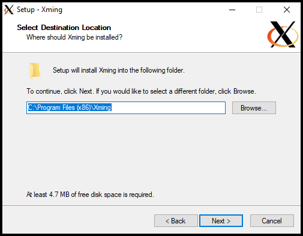

#### Install PuTTY for personal Windows computer
You can install PuTTY by going to [PuTTY download page](https://www.chiark.greenend.org.uk/~sgtatham/putty/latest.html) and choose the correct *Package files* from the package list.

Once downloaded, double-click on the file and install PuTTY to your personal Windows computer.

#### Establish SSH connection with X11 forwarding
Once you have already installed Xming and PuTTY, first run Xming as your X11 server by pressing *Windows* key, type ```Xming``` and hit *Enter*. 

Check if X11 server is successfully running by checking if there is a Xming logo on your taskbar.


Then open PuTTY by pressing *Windows* key, type ```PuTTY``` and hit *Enter*.

Manually enable X11 forward in PuTTY by going to *Connection*&rarr;*SSH*&rarr;*X11*&rarr;*X11 forwarding* and toggle the *Enable X11 forwarding*.
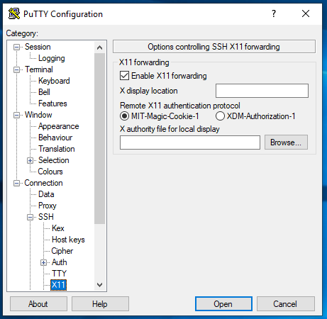

Finally go to *Session*, on your right hand side, input the Host Name following the format ```nxXX@192.168.0.1XX``` with ```XX``` is the ID of your robot. Leave everything else unchanged. You can also save all the previous steps to a session settings by using the *Load, save or delete a stored session* part of PuTTY right below where you are editing.

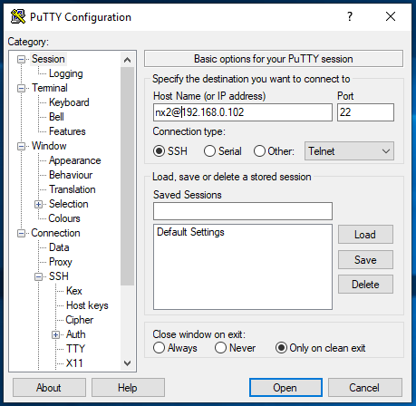

PuTTY will then attempt to connect to the robot using the aforementioned information. If the process is successful, PuTTY will then ask for the password of the robot, enter ```nvidia``` and then press *Enter*.

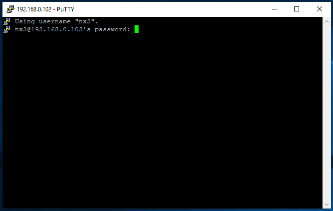

If you see the terminal of your robot, as shown in this figure, with the command line ```nxXX@nxXX-desktop:~$```, you have successfully SSH to your robot using PuTTY.

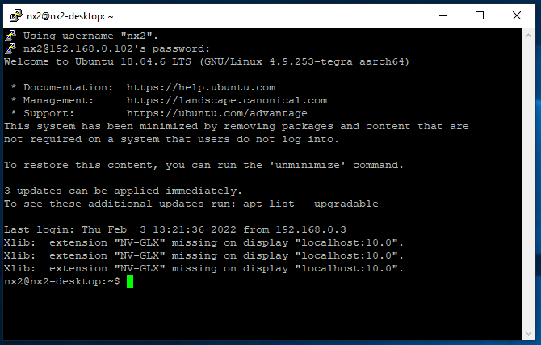

Enter ```xclock``` in the terminal and hit *Enter*, do you see a clock showing on another window?

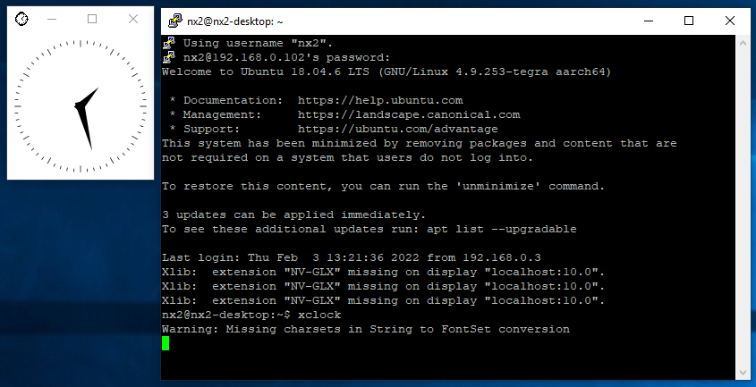

If the clock is shown, congratulations, you have successfully run PuTTY and Xming on your Windows device.

## Connect from personal Linux/Mac PC
If you are using your personal Linux/Mac laptop, you can connect to the robot using SSH through **Terminal**.

To open **Terminal** on Linux, you can directly press *Ctrl + Alt + T* or you can search it up by clicking the *Dash* icon, typing in ```terminal``` in the search box, and opening the **Terminal** application.

To open **Terminal** on Mac, click the *Launchpad* icon in the Dock, type ```terminal``` in the search field, then click *Terminal*. You can also go to *Finder*&rarr;*/Application/Utilities*, then double-click *Terminal*.

To only SSH to the robot without graphical applications, simply run the following command:
```
ssh nxX@192.168.0.1XX
```
For example, if you are trying to connect to your robot with ID 7, simply run:
```
ssh nx7@192.168.0.107
```

### SSH with X11 forwarding on personal Linux/Mac computer
For **Linux** computer, simply run the same command with the addition of flag ```-X``` to connect with X11 forwarding enabled:
```
ssh -X nxXX@192.168.0.1XX
```

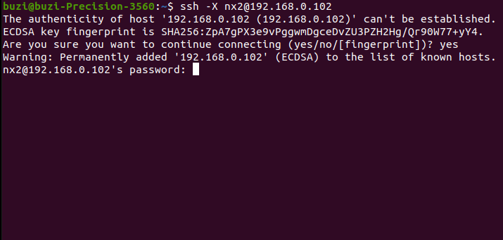

For **Mac** computer, first you have to install [XQuartz](https://www.xquartz.org/).

Then add flag ```-X``` to your SSH command:
```
ssh -X nxXX@192.168.0.1XX
```

If successfully connect, you should expect to see something like this on your terminal:

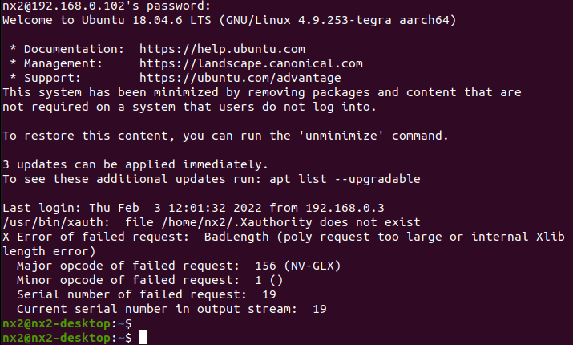

You can check if X11 forwarding is working correctly by typing in the terminal ```xclock```. If there is a clock open up on another window, X11 forwarding is correctly configured and running.

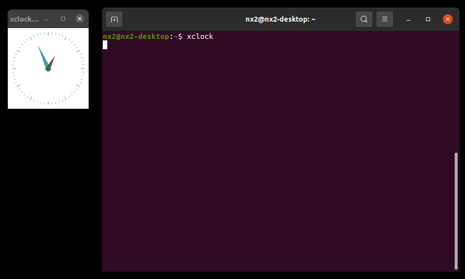

## Connect from computer workstation in lab
If you are using computer workstation in the lab, you can connect to the robot using SSH through either **PowerShell** or default **Windows terminal**.

To open Windows terminal, press *Windows + R*, then type ```cmd``` and hit Enter.

To only SSH to the robot without graphical applications, simply run the following command:
```
ssh nxX@192.168.0.1XX
```
For example, if you are trying to connect to your robot with ID 7, simply run:
```
ssh nx7@192.168.0.107
```
### SSH with X11 forwarding on computer workstation
Computer workstation in the lab will not allow you to install **PuTTY** and **Xming** to **C:/** drive, this is because your account does not have admin authorization.

Before using computer workstation to work with the robot, first make sure that <span style="color:red">you have setup the computer to connect to your network drive H:/</span>. Normally all computer workstation will automatically load your **H:/** drive when you login using your Princeton netID. However, if none is shown, please refer to [How to connect to your H: drive with Windows](https://princeton.service-now.com/service/?id=kb_article&sys_id=c12452dedb63fa0092e5f1651d96194a) from Princeton University.

#### Install Xming for computer workstation
Once you have had **H:/** drive shown on your computer workstation, you can go to the following link to [download Xming](https://sourceforge.net/projects/xming/files/latest/download).

Once downloaded, double-click on the **.exe** file to install Xming:

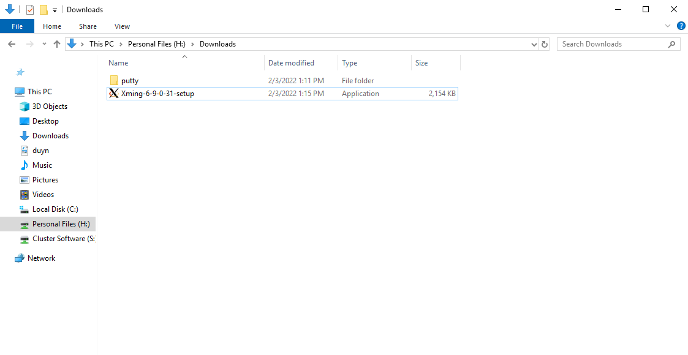

Choose *H:\ClusterDesktop\Xming* to install Xming:

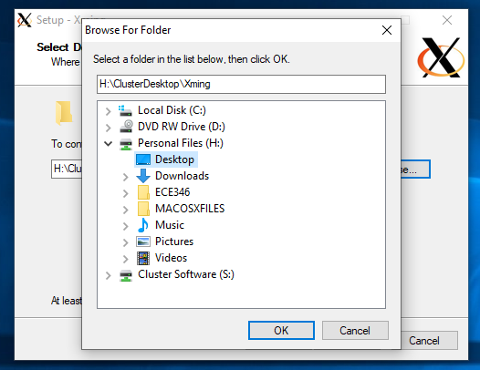

Press *Next* for all the options.

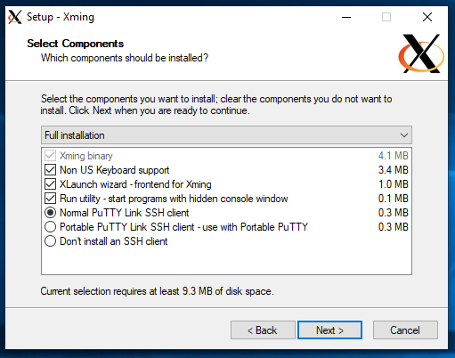

At the last step, you will see several errors on unable to create register keys, remember to press **Ignore** for all of them.

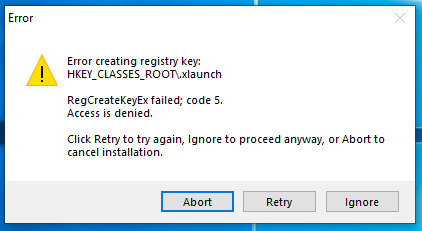

Then you will have successfully installed Xming for your compute workstation.

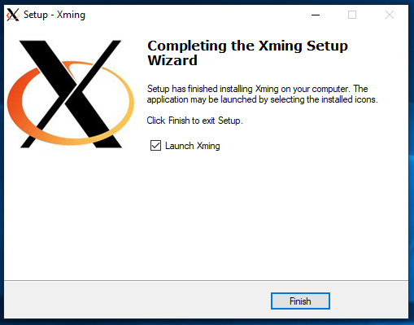

#### Install PuTTY for computer workstation
You can install PuTTY by going to [PuTTY download page](https://www.chiark.greenend.org.uk/~sgtatham/putty/latest.html) and go down to session **Alternative binary files**. There you can find the correct **putty.zip**. The computer workstation in the lab is **64-bit x86**.

Once downloaded, extract the **.zip** file. You can either move the folder to **H:/ClusterDesktop/putty** or leave it in **H:/ClusterDownloads/putty**

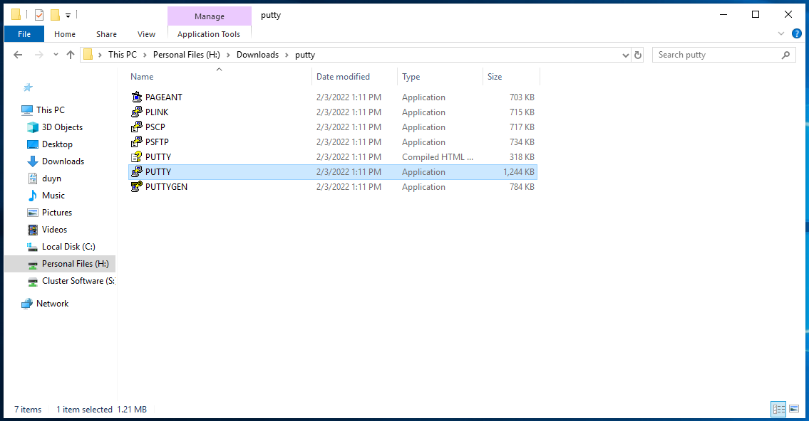

#### Establish SSH connection with X11 forwarding
Once you have already installed Xming and PuTTY, first run Xming as your X11 server. You can check to see if Xming server is running by looking at the taskbar and find Xming logo


In case Xming does not start by itself, go to *H:/ClusterDesktop/Xming/* and run *XLaunch*.

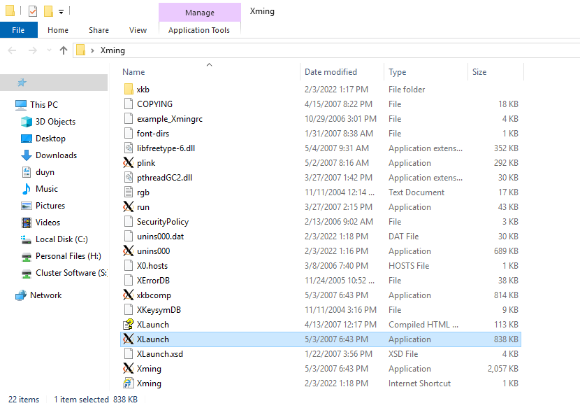

Choose *Multiple windows* and press *Next*

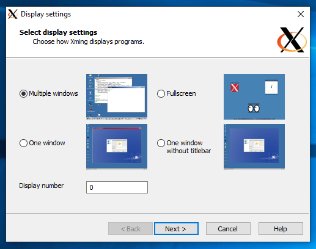

Choose *Start no client* and press *Next*


Check the Taskbar again to see if Xming is now running.

Then open PuTTY by going to the *PuTTY* folder and double-click the *PUTTY* application.


Manually enable X11 forward in PuTTY by going to *Connection*&rarr;*SSH*&rarr;*X11*&rarr;*X11 forwarding* and toggle the *Enable X11 forwarding*.


Finally go to *Session*, on your right hand side, input the Host Name following the format ```nxXX@192.168.0.1XX``` with ```XX``` is the ID of your robot. Leave everything else unchanged. You can also save all the previous steps to a session settings by using the *Load, save or delete a stored session* part of PuTTY right below where you are editing.


PuTTY will then attempt to connect to the robot using the aforementioned information. If the process is successful, PuTTY will then ask for the password of the robot, enter ```nvidia``` and then press *Enter*.


If you see the terminal of your robot, as shown in this figure, with the command line ```nxXX@nxXX-desktop:~$```, you have successfully SSH to your robot using PuTTY.


Enter ```xclock``` in the terminal and hit *Enter*, do you see a clock showing on another window?


If the clock is shown, congratulations, you have successfully run PuTTY and Xming on your Windows device.

## Code Remotely with [VS Code](https://code.visualstudio.com/)
If you want to code directly on your laptop but have the code saved in Jetson directly, one solution is to SSH into the Jetson and use vim or nano through the terminal. On the other hand, if you enjoy using modern IDEs,  [VS Code allows you to code remotely through SSH](https://code.visualstudio.com/docs/remote/ssh-tutorial).